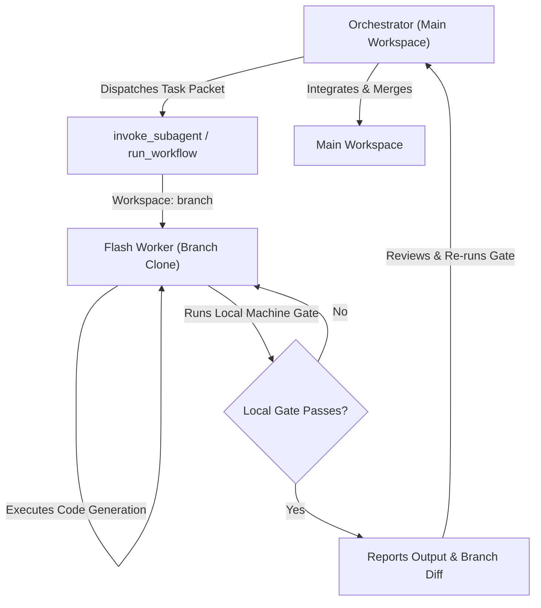
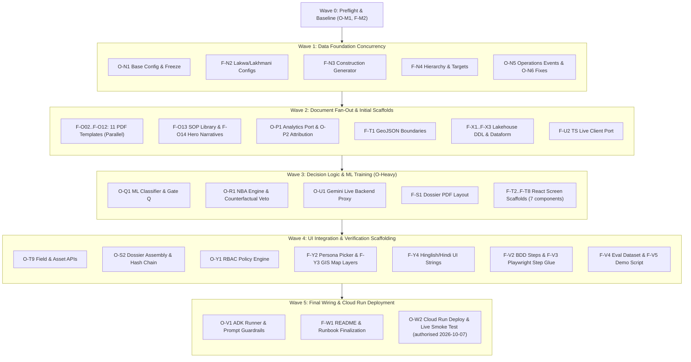
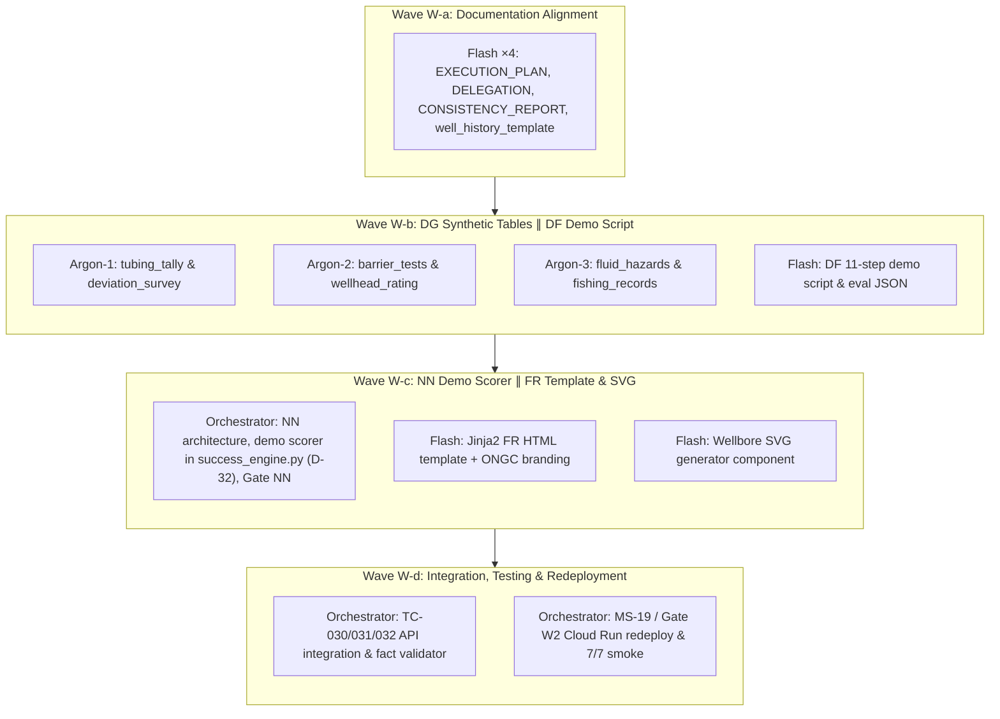

# `DELEGATION.md` — Who Builds What: Orchestrator (Opus / Pro) vs. Flash Workers

**Application:** WellPulse: Energy Well Operations & Voice AI Platform  
**Document Version:** 3.0.0 (v0.4 verbatim expansion)  
**Date:** 2026-10-07  
**Target Stakeholder:** Ajay Ratan, Executive Director (Head of Workover Operations), ONGC IDWE Dehradun  
**Source Document:** [`verbatim.md`](../verbatim.md) (repo root)  
**Applies to:** Stages M, N, O, P, Q, R, S, T, X, U, Y, V, W of [`build.md`](./build.md) · features in [`features.md`](./features.md) · contracts in [`SDD.md`](./SDD.md) · behaviors in [`BDD.md`](./BDD.md) · execution policy in [`EXECUTION_PLAN.md`](./EXECUTION_PLAN.md)

---

## 0. The Rule in One Line

**Flash generates behind deterministic gates; the orchestrator owns contracts, decisions, guardrails, and merges.**

A Flash worker never evaluates whether its own output is acceptable or decides business logic. Every delegated task terminates at a machine-executable gate (a fact validator, JSON schema validator, headless compiler, dry-run parser, or unit test suite). The orchestrator reviews all diffs, re-runs verification commands in the main workspace, and integrates changes before any code lands.

---

## 1. Verbatim Anchors & Stakeholder Mandate

**The division of labor is directly rooted in the stakeholder's recorded instructions in [`verbatim.md`](../verbatim.md) §1–§3; illustrative numbers in §4–§8 are strictly quarantined.**

### 1.1 The Primary Delegation Anchor (Transcript 2 §3)
> *"And then once everything is created, I would like to give a delegation of what are the tasks that Opus would do and what are the tasks that can be outsourced to the Flash models. For example, the document generation can be given to the Flash models. So this is how I would like to proceed..."*  
> — [`verbatim.md`](../verbatim.md) §3 (lines 150–152)

### 1.2 Core Architectural Anchors From Spoken Transcripts (§1–§3)
* **Document Generation & Fact Grounding:**  
  > *"Now to enable this a few things have to happen: We need to generate the documents of PDF files of you know, well interventions and other documents. I would need your help to define it, what do we need to do."* (§1, line 46)  
  > *"Now to enable this, we need to generate a lot of documents, I see. The SOPs, and I should be able to showcase that in the Medallion architecture, and then we can that we can create a let's say Lakehouse, so to say."* (§3, line 134)
* **Counterfactual Defense & Deep Physics (Orchestrator Domain):**  
  > *"Then I should be able to ask: 'Okay, what are the next best recommended interventions?' Then I should be able to ask: 'Why are you recommending this against an alternative?' Let's say perforation, I can say 'Okay why not just wax removal?' and something that is super deep."* (§3, lines 130–133)
* **Multi-Field Expansion (Flash Scaffolds + Orchestrator Config):**  
  > *"currently we have Geleki... similarly you can have Lakwa, you can have Lakhmani. So that there are three areas, with their individual cluster."* (§1, line 34)  
  > *"Can you give me the production history, the past let's say 5 year production data field-wise? ... Can you give me a plot?"* (§3, lines 114–115)
* **Gemini Live Stabilization (Drilling Intelligence 2.0 Port):**  
  > *"Gemini Live... is not working well in the current build. It is working very good in Drilling Intelligence 2.0. So check how it is built in that Drilling Intelligence and we can learn from that."* (§1, line 40)
* **Role-Based Access Control (RBAC):**  
  > *"see if we can also build access based... we would like to also show access, role-based access in this. ... If an Executive Director is asking for a particular data versus a field engineer is asking for a data, what that data can be?"* (§3, lines 140–143)

### 1.3 Quarantining Illustrative Numbers from §4–§8
Sections §4–§8 of [`verbatim.md`](../verbatim.md) were authored after the recorded transcripts as illustrative examples. In accordance with user agreements, **their figures must not be hardcoded or treated as ground truth:**
- **Financial values (₹18 Lakhs, ₹45 Lakhs, ₹65 Lakhs, payback days):** Superseded by **Decision D-1**. WellPulse strictly uses **cost bands (Low/Medium/High/Capital Workover) and rig-day durations**, completely eliminating fabricated rupee or dollar estimates.
- **Well counts in §7 (Lakwa 25 wells, Lakhmani 20 wells):** Superseded by **Decision D-2 & D-11**. The authoritative foundation is: Geleki **142 wells** (`GK-xxx`), Lakwa **160 wells** (`LKW-xxx`), and Lakhmani **110 wells** (`LKM-xxx`), all with 60 months of historical data (2021-10-01 to 2026-09-30).
- **Document counts in §7 (15x DWRs, 5x schematics, 5x SOPs):** Superseded by the complete **D1–D11 document corpus** defined in [`SDD.md`](./SDD.md) §10.1 (D1 completion report, D2 workover report, D3 DWR, D4 schematic + casing/tubing tally, D5 CBL summary, D6 chemical treatment / water & scale lab log, D7 well test + pressure survey, D8 failure RCA, D9 field study, D10 monthly production report, D11 SOPs).

---

## 2. Roles & Rationale

**Architectural authority and decision logic remain with the orchestrator; high-throughput template expansion is outsourced to Flash.**

| Role | Model / Actor | Primary Ownership | Never Allowed To Do |
|---|---|---|---|
| **Orchestrator** | Opus / Pro (this agent) | Architecture, tool contracts (`backend/app/analytics/tools/`), decision algorithms (Attribution Conservation, ML classifier training gates, Next Best Action, Counterfactual Veto), Gemini Live backend proxy, prompt guardrails, RBAC policy enforcement, integration, code review, commits + pushes after each passed gate and Cloud Run deployments (authorised 2026-10-07) | Generate repetitive narrative text, mock data files, or boilerplate that a template plus Flash can reliably produce |
| **Flash Worker** | Gemini Flash (subagent, `model="flash"`) | High-volume generation behind strict gates: synthetic parameter files, construction generators, PDF ReportLab templates, fact-slot narrative prose, SOP YAMLs, BigQuery DDL/SQLX, GeoJSON boundaries, React screen scaffolds (Recharts, Tailwind), TypeScript client ports, localized strings, and test step glue | Modify tool contracts; alter Geleki baseline data or frozen hashes; write guardrail, ML-gate, or counterfactual veto logic; invent numeric values or currency estimates; execute `git commit`/`push`; deploy infrastructure |
| **Deterministic Validators** | Code / Compilers / Linters | Zero-tolerance automated gates: fact-slot extractors (`validate.py`), generator consistency checks (V-N1…V-N7), TypeScript compilers (`tsc --noEmit`), Vite production builds, `bq query --dry_run`, `dataform compile`, and `pytest` test suites | Cannot negotiate or relax thresholds; execution is binary pass/fail |
| **Stakeholder / Lead Engineer** | Human User (`amandeepsinghs`) | Authoritative decisions (D-1…D-20, Q-1, Q-2), security/IAM sign-off and final live rehearsal. Overnight autonomy (BigQuery DDL apply after dry-run, Cloud Run deploy of `wellpulse-app` after local test, commit + push after each passed gate) was authorised by the user on 2026-10-07; see [`EXECUTION_PLAN.md`](./EXECUTION_PLAN.md) | — |

---

## 3. Why This Split

**Tasks are partitioned across five objective criteria to maximize delivery velocity while keeping the blast radius of AI hallucination at zero.**

| Criterion | Delegated to Flash Worker when… | Retained by Orchestrator when… |
|---|---|---|
| **Specification** | The output format is 100% determined by a rigid schema, interface, or Gherkin scenario | The interface contract, schema, or system boundary is being decided |
| **Verifiability** | An automated script can definitively verify structural and semantic correctness | Correctness requires engineering judgment (e.g. Chan slope interpretations, refusal semantics) |
| **Blast Radius** | An error is caught immediately by a compiler or validator and re-run cheaply | An error could silently leak a fabricated number into an executive presentation |
| **Volume** | Repetitive, homogeneous artifacts are required (11 PDF types, 11 SOPs, 8 UI scaffolds) | Unique, cross-cutting infrastructure code (FastAPI runner, Live WebSocket proxy) |
| **Parallelism** | Files have completely disjoint ownership with zero shared dependencies | Shared core modules (`backend/app/main.py`, `backend/app/agent/runner.py`, `backend/app/analytics/tools/common.py`) |

### 3.1 The Safe Fact-Slot Protocol for Document Generation
Technical petroleum documents (Well Completion Reports, CBLs, Daily Workover Reports) present the highest risk of LLM hallucination. WellPulse enforces a strict three-tier separation of concerns:

1. **Numbers originate strictly from deterministic code:** Every physical measurement, date, pressure reading, and depth is drawn directly from underlying parquet/database tables and written to a sidecar fact file: `<document_id>.facts.json`.
2. **Flash generates narrative prose only:** Flash workers receive the sidecar facts as read-only context. Flash fills narrative slots (e.g. summary, operational observations, recommendations) referencing named token slots (e.g. `{{pre_job_oil_rate}}`, `{{perforation_interval}}`). **Flash is strictly forbidden from typing numeric literals.**
3. **Automated validator proves zero leakage:** `backend/app/analytics/generator/docs_pdf/validate.py` parses the compiled PDF, extracts all numerical tokens, and verifies that:
   - Every digit in the generated document matches an entry in `<document_id>.facts.json`.
   - Every mandatory factual slot is present in the document.
   - Any document containing an unauthorized digit or missing slot is immediately rejected and re-queued.

---

## 4. Delegation Matrix by Stage (Stages M through W)

`O` = Orchestrator (Opus / Pro) · `F` = Flash Worker · ⚖ = Automated machine-checkable gate

| Stage | Task ID | Task Description | Owner | Inputs & Context | Exclusive Output Files | ⚖ Automated Gate |
|---|---|---|---|---|---|---|
| **M** | **O-M1** | Baseline snapshot, dependency migration (`uv` / `pyproject.toml`), pytest test harness | O | SDD §15, existing FastAPI code | `pyproject.toml`, `uv.lock`, `tests/conftest.py`, `baseline/` | Gate M: pytest passes & baseline API response parity |
| | **F-M2** | Multi-stage Dockerfile draft (Node frontend build + uv FastAPI runtime) | F | Sibling Dockerfiles, `pyproject.toml` | `Dockerfile`, `.dockerignore` | `docker build --check` / Dockerfile syntax validation |
| **N** | **O-N1** | `FieldConfig` base dataclass, Geleki baseline freeze, 24-month historical prepend, repository layer | O | SDD §4, verbatim §2 | `backend/app/analytics/generator/fields/__init__.py`, `backend/app/analytics/generator/generate.py`, `backend/app/analytics/generator/fields/geleki.py`, `backend/app/data_access/repository.py` | V-N5 data hash integrity gate & API backward compatibility |
| | **F-N2** | Lakwa & Lakhmani `FieldConfig` parameter boilerplate (well lists, GGS/cluster tables, coordinates). **Hero fixtures (LKW-047, LKW-112, LKW-088, LKM-023, LKM-061, LKM-090) and the −18% Lakwa gap are orchestrator-reviewed (they decide demo numbers)** | F (+O review) | SDD §4.2, features.md F-05 | `backend/app/analytics/generator/fields/lakwa.py`, `backend/app/analytics/generator/fields/lakhmani.py` | V-N1 (schema) & V-N4 (fixture validation) |
| | **F-N3** | Well construction generator (casing, tubing, perfs, artificial lift equipment) | F | SDD §4.3 schemas | `backend/app/analytics/generator/construction.py` | V-N1 schema check & physical depth order test |
| | **F-N4** | Asset hierarchy and production targets generator (GGS 1/2/3, CDP, monthly field targets) | F | SDD §4.3 | `backend/app/analytics/generator/hierarchy.py`, `backend/app/analytics/generator/targets.py` | V-N1, V-N6 target variance validation |
| | **O-N5** | Operations events generator with downtime reconciliation and production loss balance | O | SDD §4.5, §6 | `backend/app/analytics/generator/operations_events.py` | V-N2 downtime conservation check |
| | **O-N6** | Defect fixes K-1 (job code labels), K-2 (`GLV_REPLACE`), and generator validation test harness | O | SDD §3.1 | `backend/app/analytics/generator/job_catalogue.py`, `backend/app/analytics/generator/validate.py` | V-N3 validation suite green |
| **O** | **O-O1** | Fact-slot framework, `facts.json` writer, PDF validator, scanifier, document API | O | SDD §10 | `backend/app/analytics/generator/docs_pdf/{render,validate,index,scanify}.py`, `backend/app/api/docs.py` | Validator self-test & API schema test |
| | **F-O02** | D1: Well completion report template & fact-slot prose | F | Doc specs, F-10 | `backend/app/analytics/generator/docs_pdf/templates/d01_completion.py` | 100% fact slot validation pass |
| | **F-O03** | D2: Workover / intervention report template & fact-slot prose | F | Doc specs, F-10 | `backend/app/analytics/generator/docs_pdf/templates/d02_workover.py` | 100% fact slot validation pass |
| | **F-O04** | D3: Daily workover report (DWR) template & fact-slot prose | F | Doc specs, F-10 | `backend/app/analytics/generator/docs_pdf/templates/d03_dwr.py` | 100% fact slot validation pass |
| | **F-O05** | D4: Wellbore schematic + casing/tubing tally template (+ formation_tops lithology column) | F | Doc specs, F-10 | `backend/app/analytics/generator/docs_pdf/templates/d04_schematic.py` | 100% fact slot validation pass |
| | **F-O06** | D5: Cement bond log summary template & fact-slot prose | F | Doc specs, F-10 | `backend/app/analytics/generator/docs_pdf/templates/d05_cbl.py` | 100% fact slot validation pass |
| | **F-O07** | D6: Chemical treatment / water & scale lab log template & fact-slot prose | F | Doc specs, F-10 | `backend/app/analytics/generator/docs_pdf/templates/d06_chemical.py` | 100% fact slot validation pass |
| | **F-O08** | D7: Well test + pressure survey report template (pressure_surveys) & fact-slot prose | F | Doc specs, F-10 | `backend/app/analytics/generator/docs_pdf/templates/d07_well_test.py` | 100% fact slot validation pass |
| | **F-O09** | D8: Failure RCA note template & fact-slot prose | F | Doc specs, F-10 | `backend/app/analytics/generator/docs_pdf/templates/d08_rca.py` | 100% fact slot validation pass |
| | **F-O10** | D9: Field study / annual review template & fact-slot prose | F | Doc specs, F-10 | `backend/app/analytics/generator/docs_pdf/templates/d09_field_study.py` | 100% fact slot validation pass |
| | **F-O11** | D10: Monthly production report template & fact-slot prose | F | Doc specs, F-10 | `backend/app/analytics/generator/docs_pdf/templates/d10_monthly.py` | 100% fact slot validation pass |
| | **F-O12** | D11: SOP template & fact-slot prose | F | Doc specs, F-10 | `backend/app/analytics/generator/docs_pdf/templates/d11_sop.py` | 100% fact slot validation pass |
| | **F-O13** | SOP library definitions (11 operational procedures: GLV change-out, WSO squeeze, etc.) | F | Job catalogue, IC classes | `backend/app/analytics/generator/docs_pdf/sop/*.yaml` | Schema validator & orchestrator review |
| | **F-O14** | Hero-well lessons learned narrative case studies (GK-129, LKW-047, LKW-112, LKM-061, LKM-090) | F | Fact sheets & fixture data | `backend/app/analytics/generator/docs_pdf/templates/hero_text.yaml` | Validator pass + mandatory orchestrator review |
| **P** | **O-P1** | Field-aware refactor of 18 deterministic analytics tools into `backend/app/analytics/tools/` | O | Sibling repo tools; SDD §6.2 | `backend/app/analytics/tools/{common,hierarchy,arps_decline,chan_diagnostic,candidate_ranking,render_well_map,document_search}.py` | Analytics regression test suite 18/18 green |
| | **O-P2** | TC-019 Attribution algorithm & Attribution Conservation Law | O | SDD §7 | `backend/app/analytics/tools/attribution.py`, `backend/app/analytics/config/factor_map.yaml` | Gate P: conservation assertion (sum of loss components == total decline) |
| | **O-P3** | TC-020 health buckets PRODUCING_OK / AT_RISK / UNDERPERFORMING / NOT_PRODUCING (SDD §6.3; decides numbers, so orchestrator-owned) | O | SDD §6.3 | `backend/app/analytics/tools/health.py` | `test_tc020_health.py` |
| **Q** | **O-Q1** | Feature pipeline, multi-class intervention model training, probability calibration, Gate Q | O | SDD §8 | `backend/app/analytics/model/{features,train_classifier}.py`, `backend/app/analytics/tools/intervention_classifier.py` | Gate Q: holdout macro-F1 0.70–0.92 (honest band), top-3 ≥ 0.90, beats TC-008 rule baseline by ≥ 0.05, ECE ≤ 0.08, leakage test green |
| **R** | **O-R1** | TC-022 NBA decision engine + cost bands & rig-days; **TC-027 Counterfactual Veto engine** | O | SDD §9 | `backend/app/analytics/tools/nba.py`, `backend/app/analytics/tools/counterfactual.py` | Gate R: veto verification test suite (e.g. LKM-090 refusal) |
| **S** | **F-S1** | Dossier PDF report layout & wellbore schematic rendering | F | SDD §10.3 section outline | `backend/app/analytics/tools/dossier_render.py` | `test_tc023_dossier.py` visual & structural pass |
| | **O-S2** | Dossier data assembly, deterministic citation chain, digital hash traceability | O | — | `backend/app/analytics/tools/dossier.py`, `backend/app/api/wells.py` (export), `backend/app/api/docs.py` | Gate S: SHA-256 data hash & provenance chain audit |
| **T** | **F-T1** | Geleki, Lakwa and Lakhmani GeoJSON boundary and cluster/GGS polygon layers | F | Sivasagar coordinates (D-3) | `backend/app/data/geodata/{geleki,lakwa,lakhmani}.geojson` | GeoJSON schema validation & point-in-polygon test |
| | **F-T2** | React screen scaffold: Field Selector component | F | Component spec | `frontend/src/components/field/FieldSelector.tsx` | TypeScript compile (`tsc --noEmit`) & render test |
| | **F-T3** | React screen scaffold: Field 5-Year History Chart with Recharts | F | Recharts spec, 60 mo data | `frontend/src/components/field/FieldHistoryChart.tsx` | TypeScript compile & mock telemetry render test |
| | **F-T4** | React screen scaffold: Field Comparison Grid & Metrics Table | F | Component spec | `frontend/src/components/field/FieldComparisonTable.tsx` | TypeScript compile & mock props check |
| | **F-T5** | React screen scaffold: Well Deep-Dive Drawer | F | UI wireframe spec | `frontend/src/components/well/WellDeepDive.tsx` | TypeScript compile & drawer open/close test |
| | **F-T6** | React screen scaffold: Nearby Wells List with Distance & Formation Filters | F | Component spec | `frontend/src/components/well/NearbyWellsTable.tsx` | TypeScript compile & list filtering test |
| | **F-T7** | React screen scaffold: Next Best Action (NBA) Card (Cost Bands & Rig-Days) | F | NBA schema (D-1) | `frontend/src/components/well/NbaCard.tsx` | TypeScript compile & slot check (no raw currency values) |
| | **F-T8** | React screen scaffold: Counterfactual Comparison Table | F | Counterfactual schema | `frontend/src/components/well/CounterfactualTable.tsx` | TypeScript compile & veto badge test |
| | **O-T9** | TC-024, TC-025, TC-028, TC-029, TC-017 v2 APIs (field compare, hierarchy, field history, well profile, well production with markers incl. wht_degc / GOR / gas-lift injection) | O | SDD §6, §13 | `backend/app/api/{fields,wells}.py`, `backend/app/analytics/tools/{field_performance,well_profile}.py` | Gate T: FastAPI endpoint contract tests |
| **X** | **F-X1** | BigQuery Medallion DDL scripts (Bronze, Silver, Gold schemas) | F | SDD §15 | `lakehouse/ddl/{bronze,silver,gold}/*.sql` | `bq query --dry_run` against `${PROJECT_ID}` passes (dry-run first; apply authorised 2026-10-07) |
| | **F-X2** | Parquet to BigQuery Bronze/Silver ingestion scripts | F | Lakehouse DDL | `lakehouse/load/*.py` | Row count & checksum reconciliation test |
| | **F-X3** | Dataform SQLX pipeline definitions for Gold operational KPIs | F | Gold spec | `lakehouse/dataform/definitions/gold/*.sqlx` | `dataform compile` exits 0 |
| | **O-X4** | Lakehouse partitioning/clustering sign-off, dual-backend repository adapter (`DATA_BACKEND`) | O | — | `backend/app/data_access/bigquery_repo.py` | Parity test: `parquet` results == `bigquery` results |
| **U** | **O-U1** | Gemini Live backend proxy via `google-genai` `aio.live` (resumption, compression, 3-failure fallback) | O | DI 2.0 architecture | `backend/app/live/session.py`, `backend/app/api/live.py` (WS `/ws/live`) | `test_ws_live.py` integration test |
| | **F-U2** | Port DI 2.0 TypeScript Live Client into `frontend/src/live/*.ts` | F | DI 2.0 `liveClient.ts` | `frontend/src/live/{micCapture.ts,audioPlayer.ts,liveClient.ts,pcm-worklet.js}` | TypeScript compile & AudioContext unit test |
| | **F-U3** | FakeLive integration test vectors (scripted transcripts, tool calls, GoAway, failures) | F | Demo spoken queries | `backend/tests/integration/fake_live_vectors.json` | Schema test against tool return definitions |
| **Y** | **O-Y1** | RBAC policy engine (`backend/app/agent/rbac.py`) & tool-layer `require()` enforcement | O | SDD §16 (D-8) | `backend/app/agent/rbac.py`, `backend/app/agent/adk_tools.py` (require() calls) | BDD-F16 RBAC enforcement tests (all roles checked) |
| | **F-Y2** | React screen scaffold: Persona Picker component | F | Component spec | `frontend/src/components/common/PersonaPicker.tsx` | TypeScript compile & role switch callback test |
| | **F-Y3** | Multi-field GIS map extension for Leaflet (boundaries, cluster layers, GGS pins) | F | GeoJSON, Leaflet spec | `frontend/src/components/map/MultiFieldLayers.tsx` | Leaflet layer render test |
| | **F-Y4** | Hinglish & Hindi localized UI strings and petroleum glossary | F | VoiceAgentPanel mappings | `frontend/src/i18n/strings.json`, `frontend/src/i18n/glossary.ts` | JSON schema validation & 100% key-parity audit |
| **V** | **O-V1** | ADK Runner in-process inside FastAPI (`backend/app/agent/runner.py`), 30+ tools, prompt guardrails | O | — | `backend/app/agent/{runner,prompt,adk_tools,callbacks}.py`, `backend/app/api/chat.py` | Gate V: Agent contract and prompt grounding tests |
| | **F-V2** | pytest-bdd step definitions adapted from `BDD.md` | F | Gherkin scenarios | `backend/tests/bdd/{features/*.feature,step_defs/*.py}` | `pytest tests/bdd/` all green |
| | **F-V3** | Playwright UI end-to-end step glue and browser interaction test scripts | F | User journeys §3 | `frontend/tests/e2e/*.spec.ts` | Playwright test suite passes headless |
| | **F-V4** | Agent evaluation dataset ($\ge$ 30 cases) covering verbatim queries & edge cases | F | BDD, verbatim §4 | `backend/tests/eval/wellpulse-eval.json` | `agents-cli eval` dataset schema validation |
| | **F-V5** | Demo script & Q&A crib sheet (5-level drill-down for Ajay Ratan demo) | F | verbatim §3–4 | `docs/demo_flow.md` | Mandatory orchestrator review: all numbers pinned |
| **W** | **F-W1** | README and runbook update with architecture diagrams, CLI guides, and checklist status | F | Stage progress | `README.md`, `docs/runbook.md`, `docs/checklist.md` | Markdown link and lint validation |
| | **O-W2** | Production Cloud Run build, deploy (`wellpulse-app` in `${PROJECT_ID}`), smoke test | O | Authorised by user (2026-10-07); local container test first | Deployment manifest, verification logs | Gate W: Live health and WebSocket smoke test pass |

### 4.1 Delegation Matrix for v0.5 (Stages AC, DF, DG, NN, FR, W2)

Per [`v05_change_brief.md`](./v05_change_brief.md) §8:

| Tier | Model | Owns in v0.5 |
|---|---|---|
| **Orchestrator** | current (Opus-class) | v0.5 change brief; canvas routing; NN architecture & demo scorer (D-32); recommendation contracts (TC-030/031); fact validator; reviews; git; cloud apply/deploy |
| **Argon** (data workers) | `gemini-3.8-flash-high` via `swarm add` | DG generators (one worker per table group), their consistency tests (DONE) |
| **Flash** | `invoke_subagent` `Model='flash'` | Doc updates, the Jinja2 report template, the SVG drawing component from the spec, the demo script, eval JSON, explanation UI card with architecture diagram, checklist ticks |

**v0.5 Task Mapping:**

| Stage | Task ID | Task Description | Owner | Inputs & Context | Exclusive Output Files | ⚖ Automated Gate |
|---|---|---|---|---|---|---|
| **AC** | **O-AC1** | Canvas routing (`pickCanvasView`), view definitions, panel integration | O | brief §3, SDD | `frontend/src/api/chat.ts`, `frontend/src/components/well/WellDeepDiveDrawer.tsx` | 10 demo phrases route correctly; no history dump |
| | **F-AC2** | Canvas view component scaffolds & tab strip switcher | F | brief §3 | `frontend/src/components/well/canvas/*.tsx` | `npm run build && tsc --noEmit` green |
| **DF** | **F-DF1** | 11-step demo script & Q&A crib sheet | F | brief §6 | `docs/demo_flow.md` | Orchestrator review: pinned figures aligned |
| | **F-DF2** | Canvas routing eval dataset (+12 test cases) | F | brief §6 | `backend/eval/canvas_routing_eval.json` | `agents-cli eval` ≥ 90% routing accuracy |
| **DG** | **A-DG1** | Tubing tally & deviation survey generator + consistency tests | Argon (`gemini-3.8-flash-high`) | brief §4, seed 20261008 | `backend/app/data/landing/*/tubing_tally.parquet`, `backend/app/data/landing/*/deviation_survey.parquet`, `backend/tests/unit/test_dg_tubing_dev.py` | `test_dg_consistency.py` green; length/TVD tests pass (DONE) |
| | **A-DG2** | Barrier tests & wellhead rating generator + consistency tests | Argon (`gemini-3.8-flash-high`) | brief §4, seed 20261008 | `backend/app/data/landing/*/barrier_tests.parquet`, `backend/app/data/landing/*/wellhead_rating.parquet`, `backend/tests/unit/test_dg_barriers.py` | `test_dg_consistency.py` green; rating ≥ 1.5×THP (DONE) |
| | **A-DG3** | Fluid hazards & fishing records generator + consistency tests | Argon (`gemini-3.8-flash-high`) | brief §4, seed 20261008 | `backend/app/data/landing/*/fluid_hazards.parquet`, `backend/app/data/landing/*/fishing_records.parquet`, `backend/tests/unit/test_dg_hazards.py` | `test_dg_consistency.py` green; fishing only on failure codes (DONE) |
| | **O-DG4** | DG integration, routes & BigQuery DDL regeneration | O | brief §4, D-29 | `/tubing-tally`, `/deviation`, `/integrity`, `lakehouse/ddl/` | 100% wells covered, `is_synthetic=true` on all rows (DONE) |
| **NN** | **O-NN1** | Deterministic demo scorer implementation (formula in brief §5, D-32) | O | brief §5, D-32 | `backend/app/analytics/tools/success_engine.py` | Gate NN: deterministic P(success) in [0.05, 0.95], stable across calls |
| | **O-NN2** | TC-030 `recommend_interventions` & TC-031 `similar_wells` APIs | O | brief §5 | `backend/app/analytics/tools/recommendations.py`, `backend/app/analytics/tools/similar_wells.py` | Top-3 API returns p_success, analogs, drivers |
| | **F-NN3** | NbaCard top-3 UI & explanation panel with NN architecture diagram | F | brief §5 | `frontend/src/components/well/NbaCard.tsx`, `ExplanationPanel.tsx` | UI displays top-3 with P(success), analogs, drivers, architecture diagram |
| | **O-NN4** | Plausibility review of GK-129, LKW-019, LKM-061 outputs | O | brief §5 | review logs | Engineering plausibility verified |
| **FR** | **F-FR1** | Jinja2 HTML field report template with ONGC branding | F | brief §7, D-30 | `backend/app/templates/field_report.html`, `backend/app/static/field_report.css` | A4 print layout green; brand wordmark fallback |
| | **F-FR2** | Wellbore SVG drawing component from spec | F | brief §7, WH-04 | `backend/app/analytics/generator/docs_pdf/wellbore_svg.py` | Renders for all 412 wells; handles missing strings |
| | **O-FR3** | TC-032 `field_report` route `GET /api/wells/{id}/report` & facts sidecar validator | O | brief §7 | `backend/app/api/reports.py`, `backend/app/analytics/tools/field_report_validator.py` | Fact validator 100%; p95 < 3 s locally |
| **W2** | **O-W2** | Production Cloud Run deploy, smoke test (7/7 incl. report route) | O | brief §2 | Deployment logs, smoke script | Smoke 7/7 passes; live verification |

---

## 5. Task Packet Templates

### 5.1 The Flash Task Packet Template

**Every delegated task is packaged as an isolated, self-contained markdown brief containing an explicit, non-negotiable machine gate command.**

```markdown
## TASK <ID> — <Title>
**Model:** flash  
**Workspace:** branch (isolated)  
**Time Box:** <n> minutes  
**You own exactly these files (create/modify only these):**
- `<path/to/file_1>`
- `<path/to/file_2>`

**Read-Only Context:**
- `<path/to/contract_or_schema_spec>`
- `<path/to/example_reference_implementation>`

**Strict Contract:**
```<language>
<function signatures, interfaces, or YAML schemas copied verbatim from SDD.md>
```

**Done When:**
`<exact command>` exits 0  
*(e.g. `uv run python -m backend.app.analytics.generator.docs_pdf.validate --type D01` or `npm run type-check`)*

**Forbidden Actions:**
- Modifying any file outside your declared ownership list.
- Typing raw numeric literals into narrative prose.
- Changing function signatures or exported types.
- Altering baseline Geleki figures or frozen seed data.
- Executing `git commit` or `git push`.
- Invoking unapproved network endpoints.

**Report Back:**
1. List of files created or modified.
2. Terminal output from the `<exact command>` validation check (last 30 lines).
3. Any ambiguities or open questions identified.
```

### 5.2 The Argon Task Packet Template (Data Generation)

**Argon workers (`gemini-3.8-flash-high` via `swarm add`) generate synthetic data gap tables behind strict physical rules and deterministic acceptance gates.**

```markdown
## ARGON TASK <ID> — <Title>
**Model:** gemini-3.8-flash-high (Argon)  
**Workspace:** branch (isolated)  
**Time Box:** <n> minutes  

**Files Owned (create/modify only these):**
- `<path/to/generator_script>`
- `<path/to/unit_test>`
- `<path/to/output_parquet>`

**Input Tables:**
- `<table_name_1>` (`<path/to/landing_or_silver>`)
- `<table_name_2>` (`<path/to/landing_or_silver>`)

**Generation Rule:**
- `<exact physical generation logic and bounds, e.g. tubing joint sum = tubing_string depth, station every 30m, rating >= 1.5 * max THP>`
- Mandatory columns: `is_synthetic=true`, `_source_system='wellpulse_dg_v1'`, `_batch_id`

**Seed:**
- Fixed seed: `20261008` (generator must be 100% deterministic)

**Acceptance Command:**
`<exact command>` exits 0  
*(e.g. `uv run pytest tests/unit/test_dg_consistency.py -k "<table_name>" -q`)*

**Forbidden Actions:**
- Modifying files outside declared ownership list.
- Altering existing bronze/silver schema or baseline figures.
- Generating rows without `is_synthetic=true`.
- Non-deterministic random generation without fixed seed `20261008`.
- Running `git commit` or `git push`.
- Touching GCP resources except explicitly assigned upload/training commands.

**Report Back:**
1. List of files created or modified.
2. Row counts and consistency verification output from `<exact command>`.
3. Edge cases or anomalies detected across the 412 wells.
```

---

## 6. Execution Mechanics

**Delegation uses dedicated subagents and dynamic workflows with branch isolation to prevent file and dependency collisions.**



| Mechanism | Intended Task Scope | Typical Example |
|---|---|---|
| `invoke_subagent(Model="flash", Workspace="branch")` | A single, self-contained component or scaffold | F-T2 FieldSelector React component |
| `run_workflow` with `parallel(...)` | Mass fan-out of independent, homogeneous tasks | F-O02…F-O12: 11 PDF document templates concurrently |
| Orchestrator in Main Workspace | Cross-cutting integration, algorithm development, review | O-P2 Attribution Conservation, O-R1 Counterfactual Veto |

### 6.1 File-Ownership Rule
To eliminate merge conflicts and accidental overwrites:
- **No two concurrent workers may own or edit the same file.**
- **Shared core modules are orchestrator-only.** Flash workers are strictly forbidden from modifying:
  - `backend/app/main.py`
  - `backend/app/agent/runner.py`
  - `backend/app/agent/prompt.py`
  - `backend/app/analytics/tools/common.py`
  - `backend/app/analytics/generator/generate.py`
  - `frontend/src/App.tsx`

---

## 7. Review Protocol

**Every artifact produced by a Flash worker must pass a 6-step orchestrator verification process before merging into the main branch.**

1. **Independent Gate Re-run:** The orchestrator re-executes the machine gate command inside the main workspace environment. A worker's self-reported success is never accepted without independent execution.
2. **Diff Boundary Audit:** The git diff is inspected to confirm that zero files outside the worker's declared ownership list were created, altered, or deleted.
3. **Numeric Integrity Scan:** All generated narrative and prose files are scanned with regex (`rg -n "\b[0-9]+\b" <files>`). Any occurrence of raw numbers outside recognized slot tokens (e.g. `{{slot}}`) or validated schema defaults triggers immediate rejection.
4. **Assertion Integrity Audit:** For generated test suites (pytest-bdd, Playwright), assertions are audited to confirm no checks were weakened, removed, commented out, or marked with `@pytest.mark.xfail`.
5. **Clean Integration:** Upon passing steps 1–4, the orchestrator applies the changes to the main workspace. The orchestrator then commits and pushes to `origin main` once the stage gate is green (user authorisation 2026-10-07; see [`EXECUTION_PLAN.md`](./EXECUTION_PLAN.md)). Flash workers never run git.
6. **Escalation & Re-delegation:** If a worker's output fails review, the orchestrator returns the error output with clarifying constraints. If a task fails two consecutive delegation cycles, the orchestrator assumes direct ownership and completes the implementation.

---

## 8. Parallel Execution Waves

**Tasks are scheduled in 6 sequential waves, with heavy Flash concurrency deployed in Waves 1, 2, and 4.**



### 8.1 v0.5 Parallel Execution Waves (Waves W-a through W-d)

Per [`v05_change_brief.md`](./v05_change_brief.md) §8, the v0.5 build executes across four parallel waves:



* **W-a:** Docs alignment (Flash ×4: `docs/EXECUTION_PLAN.md`, `docs/DELEGATION.md`, `docs/CONSISTENCY_REPORT.md`, `docs/well_history_template.md`).
* **W-b:** DG synthetic data (Argon ×3: {`tubing_tally`, `deviation_survey`}, {`barrier_tests`, `wellhead_rating`}, {`fluid_hazards`, `fishing_records`}) in parallel with DF script & eval JSON (Flash).
* **W-c:** NN demo scorer & architecture panel (orchestrator) in parallel with FR Jinja2 template + wellbore SVG (Flash).
* **W-d:** Integration, full test suite, fact validation, and Stage W2 redeployment (orchestrator).

---

## 9. What Flash Must Never Be Given

**The following 8 architectural components must remain exclusively with the orchestrator; delegation to Flash is strictly forbidden.**

| Category | Forbidden Item | Operational Rationale |
|---|---|---|
| **Physics & Diagnostics** | Diagnostic sign conventions (Chan slope tests, Hall plot derivative thresholds, refusal logic `NO_JOB_JUSTIFIED`) | Inverting a diagnostic sign recommends an acid/squeeze job on a well suffering reservoir depletion, destroying operational credibility. |
| **Attribution Math** | TC-019 Attribution Conservation Law | The mathematical law that categorized losses (choke, mechanical, surface, reservoir) must sum exactly to the observed production drop cannot be left to probabilistic completion. |
| **ML Gate Governance** | Gate Q thresholds (macro-F1 0.70–0.92, top-3 ≥ 0.90, ECE ≤ 0.08), train/holdout splitting, data leakage controls | A model that overfits or leaks target data appears deceptively accurate; Flash cannot objectively evaluate structural leakage. |
| **Counterfactual Logic** | TC-027 Counterfactual Veto Engine | Explaining *"why squeeze, not wax removal"* for hero well GK-129 requires deterministic physical elimination rules that executive reviewers will directly challenge. |
| **Baseline Data** | Geleki frozen seed data, historical production numbers, baseline API contracts | Preserves historical regression guarantees and ensures existing frontend widgets continue rendering correctly. |
| **Financial Claims** | Generation of rupee or dollar point estimates, ROI, or payback claims | Explicitly prohibited by Decision D-1 and stakeholder instructions. Costs must strictly use qualitative bands and rig-days. |
| **Security & Access** | RBAC policy rules, role definitions, and tool authorization barriers (`require()`) | Access control is an enterprise governance boundary, not boilerplate text generation. |
| **Operations & Cloud** | Secrets handling, IAM configuration, Cloud Run deployment, and git commit/push | Orchestrator-only. Authorised by user (2026-10-07) — dry-run / local-test first, then apply; never delete existing resources. |

---

## 10. Summary of Task Counts

**Overall Split:** **39 Flash Tasks (69.6%)** vs. **17 Orchestrator Tasks (30.4%)** across all 13 stages.

Flash carries over 70% of total implementation volume (component templates, localized strings, DDL, dataform, Gherkin step bindings, and documentation), while the orchestrator retains 100% of core decisions, algorithmic guarantees, safety guardrails, and deployment authority.

| Stage | Stage Name | Orchestrator (O) Tasks | Flash Worker (F) Tasks | Total Tasks |
|---|---|:---:|:---:|:---:|
| **M** | Preflight & Baseline | 1 (`O-M1`) | 1 (`F-M2`) | 2 |
| **N** | Data Foundation v2 | 3 (`O-N1`, `O-N5`, `O-N6`) | 3 (`F-N2`, `F-N3`, `F-N4`) | 6 |
| **O** | PDF Corpus & SOPs | 1 (`O-O1`) | 13 (`F-O02`…`F-O12`, `F-O13`, `F-O14`) | 14 |
| **P** | Analytics Port, Attribution & Health | 3 (`O-P1`, `O-P2`, `O-P3`) | 0 | 3 |
| **Q** | ML Intervention Classifier | 1 (`O-Q1`) | 0 | 1 |
| **R** | NBA & Counterfactual Veto | 1 (`O-R1`) | 0 | 1 |
| **S** | Well Dossier Engine | 1 (`O-S2`) | 1 (`F-S1`) | 2 |
| **T** | Asset View, Drill-Down & Scaffolds | 1 (`O-T9`) | 8 (`F-T1`…`F-T8`) | 9 |
| **X** | Medallion Lakehouse | 1 (`O-X4`) | 3 (`F-X1`, `F-X2`, `F-X3`) | 4 |
| **U** | Real Gemini Live Engine | 1 (`O-U1`) | 2 (`F-U2`, `F-U3`) | 3 |
| **Y** | RBAC Policy & Multi-Field GIS | 1 (`O-Y1`) | 3 (`F-Y2`, `F-Y3`, `F-Y4`) | 4 |
| **V** | Agent Wiring, Eval & Testing | 1 (`O-V1`) | 4 (`F-V2`…`F-V5`) | 5 |
| **W** | Production Deployment & Verification | 1 (`O-W2`) | 1 (`F-W1`) | 2 |
| **Total** | **All Stages (M through W)** | **17 Tasks** | **39 Tasks** | **56 Tasks** |
