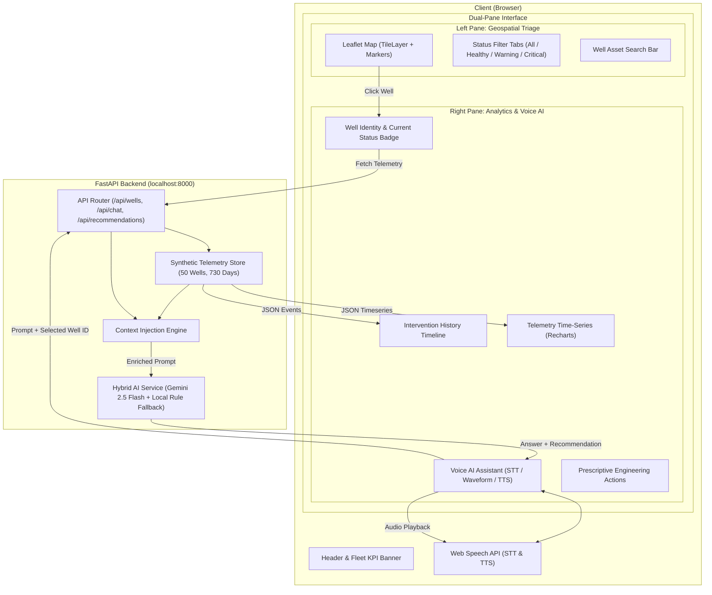

# Software Design Document (SDD)
## WellPulse: Energy Well Operations & Voice AI Platform

**Document Version:** 1.0.0  
**Status:** Approved  
**Author:** Energy AI Architecture Team  

---

## 1. System Overview & Architecture

WellPulse is designed as a decoupled, local-first client-server application. The frontend is a modern single-page web app built with React, Vite, and Tailwind CSS. The backend is an asynchronous Python service built with FastAPI, providing REST APIs, synthetic petroleum telemetry generation, and an intelligent contextual AI conversational pipeline with voice integration.



---

## 2. Technology Stack & Framework Selection

| Layer | Technology | Version | Rationale |
|---|---|---|---|
| **Frontend Framework** | React + Vite | React 18+, Vite 5+ | Fast HMR, instant local startup, component modularity |
| **Styling & Icons** | Tailwind CSS + Lucide Icons | v3+, latest | Dark SCADA energy theme, responsive layout, crisp iconography |
| **Geospatial Mapping** | Leaflet + React-Leaflet | Leaflet 1.9+ | High-performance offline/local vector rendering, custom SVG pins |
| **Analytics Charts** | Recharts | 2.12+ | Native React SVG charts, responsive container, smooth tooltips |
| **Audio & Speech** | Web Speech API | W3C Standard | Zero external audio binary dependencies, low-latency in-browser STT/TTS |
| **Backend Framework** | FastAPI | 0.110+ | High-speed async IO, automatic OpenAPI Swagger docs, Pydantic typing |
| **Server Engine** | Uvicorn | 0.28+ | ASGI production-grade local web server |
| **Data Generation** | NumPy + Python standard lib | 1.26+ | Fast generation of 730-day realistic decline curves and noise |
| **AI Reasoning** | Google GenAI (`google-genai`) | 0.1+ | Gemini 2.5 Flash for contextual Q&A and workover recommendations |

---

## 3. Data Models & API Schemas

### 3.1 Well Summary Model
```typescript
interface Well {
  id: string;                      // e.g. "GLK-101"
  name: string;                    // e.g. "Geleki #101 (Tipam Sand TS-2)"
  coordinates: {
    lat: number;                   // e.g. 26.7413 (Sivasagar, Assam)
    lng: number;                   // e.g. 94.67139
  };
  basin: string;                   // "Assam-Arakan Basin, India (ONGC)"
  formation: string;               // e.g. "Tipam Sand TS-2", "Barail BMS"
  lift_type: string;               // "Continuous Gas Lift" | "Sucker Rod Pump (SRP)" | "ESP"
  status: "healthy" | "warning" | "failed";
  current_metrics: {
    oil_bopd: number;              // Current daily oil (e.g. 265 BOPD)
    gas_mcfd: number;              // Dissolved gas flow (MCFD)
    water_cut_pct: number;         // Mature brownfield water cut (e.g. 79.1%)
    tubing_pressure_psi: number;   // Tubing head pressure (psi)
    casing_pressure_psi: number;   // Continuous gas lift injection pressure (psi)
    choke_pct: number;             // Surface choke opening %
    uptime_pct: number;            // 30-day operational uptime
  };
}
```

### 3.2 Historical Telemetry Record (730 Daily Points)
```typescript
interface TelemetryPoint {
  date: string;                    // "YYYY-MM-DD"
  oil_bopd: number;
  gas_mcfd: number;
  water_cut_pct: number;
  tubing_pressure_psi: number;
  casing_pressure_psi: number;
}
```

### 3.3 Workover & Intervention Record
```typescript
interface WorkoverRecord {
  id: string;                      // e.g. "WO-2025-03"
  date: string;                    // "2025-03-14"
  type: string;                    // "Acid Stimulation" | "ESP Replacement" | "Scale Squeeze" | "Perforation"
  cost_usd: number;                // e.g. 42000
  contractor: string;              // e.g. "NexTier Oilfield Solutions"
  description: string;             // Detailed narrative
  outcome: "Success" | "Partial" | "Failed";
  flow_delta_bopd: number;         // Net flow impact (e.g. +140 or -20)
}
```

---

## 4. REST API Endpoint Specifications

| Method | Route | Description |
|---|---|---|
| `GET` | `/api/health` | System health check and status |
| `GET` | `/api/wells` | Fetch all wells with optional `?status=warning&basin=Permian` filters |
| `GET` | `/api/wells/kpis` | Fleet-wide aggregate metrics (total, healthy, warning, failed counts) |
| `GET` | `/api/wells/{id}` | Detailed well metadata and current operating parameters |
| `GET` | `/api/wells/{id}/history` | 24-month historical telemetry time-series array |
| `GET` | `/api/wells/{id}/workovers` | Chronological list of historical interventions and workovers |
| `POST` | `/api/wells/{id}/chat` | Contextual AI chat query regarding well history and diagnostics |
| `POST` | `/api/wells/{id}/recommendations` | Generate structured engineering recommendation for the well |

---

## 5. Voice & AI Context Pipeline

### 5.1 Speech-to-Text (STT)
- Utilizes the standard W3C `webkitSpeechRecognition` / `SpeechRecognition` API.
- Listens when the user toggles the microphone button.
- Updates an interactive sound-wave canvas/CSS component during speech input.
- Automatically populates the prompt box and dispatches the query upon silence or user click.

### 5.2 Context Injection Engine
When a query arrives at `/api/wells/{id}/chat`, the backend automatically builds a rich domain prompt:
```
System Context:
You are an expert Senior Petroleum Production Engineer and Diagnostics Assistant for the WellPulse platform.
The user is inspecting well: {name} (ID: {id}, Status: {status}).
Formation: {formation}, Artificial Lift: {lift_type}.
Current Telemetry: Oil={oil_bopd} BOPD, Gas={gas_mcfd} MCFD, Water Cut={water_cut_pct}%, Tubing Pressure={tubing_psi} psi.
Historical Summary (Past 24 Months):
- Peak Production: {peak_bopd} BOPD on {peak_date}
- Decline Rate: {decline_rate}%
- Water Breakthrough observed on: {water_spike_date}
Workover History:
{workover_records_formatted}

Instruction: Answer the user's question with precise technical accuracy, referencing dates, operations, costs, and flow deltas.
Always recommend concrete engineering next steps when requested or when diagnosing a problem.
```

### 5.3 Text-to-Speech (TTS)
- The returned response is passed to the browser's `window.speechSynthesis` engine with smooth pitch and rate settings.
- The user can pause, replay, or mute audio at any time.

---

## 6. Resilience & Hybrid Fallback Engine
- **Primary AI Mode**: If `GEMINI_API_KEY` is present in the environment or `.env`, the backend connects to Gemini 2.5 Flash via `google-genai`.
- **Local Fallback Mode**: If no API key is provided, the backend seamlessly routes to a **Deterministic Petroleum Diagnostic Engine**. This engine analyzes the actual telemetry metrics, water cut trends, and workover logs of the selected well and constructs expert-level diagnostic summaries and structured recommendations.
- This ensures the application **never fails** during local evaluation or offline demos.
