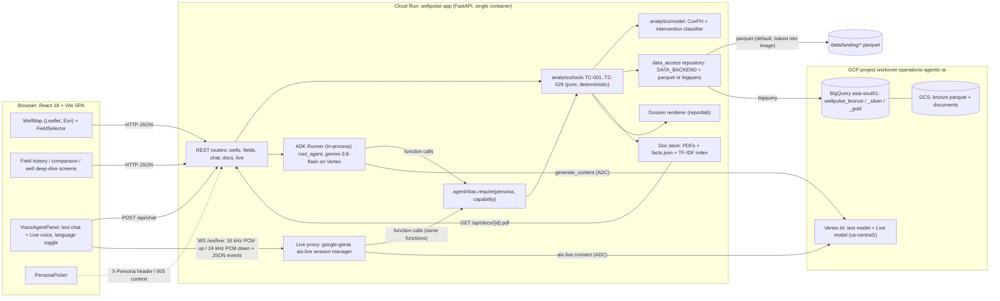
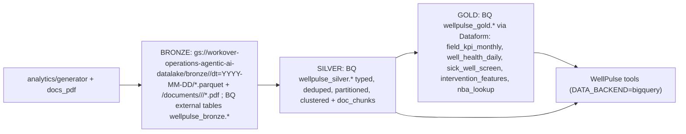

# Software Design Document (SDD)
## WellPulse: Energy Well Operations & Voice AI Platform

**Document Version:** 3.0.0 (v0.4 "verbatim expansion")
**Date:** 2026-10-07
**Status:** Approved for build; all decisions D-1…D-20 resolved (§19.2); autonomous overnight execution authorised by the user 2026-10-07 ([`EXECUTION_PLAN.md`](./EXECUTION_PLAN.md))
**Supersedes:** v1.0.0 (single-field, prompt-stuffed chat, browser TTS)
**Inputs:** [`verbatim.md`](../verbatim.md) (primary source) → [`BRD.md`](./BRD.md) → [`features.md`](./features.md) (what) → [`BDD.md`](./BDD.md) (behaviour) → **this doc** (how) → [`build.md`](./build.md) (stages M, N, O, P, Q, R, S, T, X, U, Y, V, W) → [`checklist.md`](./checklist.md) → [`EXECUTION_PLAN.md`](./EXECUTION_PLAN.md)

> [!IMPORTANT]
> **The answer in one paragraph.** WellPulse stays the product and the UI (D-10). Behind its existing REST shapes we replace the 50-well, `datetime.now()`-relative JSON file with the proven 3-field data foundation, port the 18 deterministic analytics tools from the sibling ADK repo into `backend/app/analytics/`, add 11 new tools (TC-019…TC-029), and replace the prompt-stuffed chat with an **in-process ADK `Runner`** that can only state numbers returned by those tools. The fake "Gemini Live" WebSocket is replaced with a real **google-genai Live proxy** ported from Drilling Intelligence 2.0, calling the **same** tool functions. All model calls move to **Vertex AI with ADC**; the text model stays `gemini-3.8-flash` (D-13).

### How to read the anchors in this doc
Every requirement cites [`verbatim.md`](../verbatim.md):

| Tag | Meaning | Authority |
|---|---|---|
| `T1: "…"` | §1, spoken transcript 1 | Stakeholder words. Binding |
| `T2: "…"` | §3, spoken transcript 2 (demo flow) | Stakeholder words. Binding |
| `V§2 WS-n` | §2 work-stream breakdown | Requirement framing. Binding on scope, not on numbers |
| `V§4…V§8` | Agent-written demo script, Lakehouse, RBAC, delegation, checklist | **Illustrative.** Numbers in these sections (e.g. "₹18 Lakhs", "142 bar", "42 wells", "25 / 20 wells") are **not in the data** and are never used as targets |
| `derived` | No verbatim anchor | Stated reason: integrity rule, defect fix, or engineering necessity |

Design targets that are pinned only after Stage N are written as «target ± tol».

---

## Table of contents
1. [Purpose, scope, tenets](#1-purpose-scope-tenets)
2. [Target architecture](#2-target-architecture)
3. [Current-state defects](#3-current-state-defects)
4. [Target repository layout](#4-target-repository-layout)
5. [Data model](#5-data-model)
6. [Tool contracts TC-001…TC-029](#6-tool-contracts-tc-001tc-029)
7. [Decline attribution algorithm (TC-019)](#7-decline-attribution-algorithm-tc-019)
8. [ML intervention classifier (TC-021) and Gate Q](#8-ml-intervention-classifier-tc-021-and-gate-q)
9. [Next-best-action and counterfactual (TC-022, TC-027)](#9-next-best-action-and-counterfactual-tc-022-tc-027)
10. [Documents, SOPs, dossier PDF](#10-documents-sops-dossier-pdf)
11. [Gemini Live design](#11-gemini-live-design)
12. [Agent design](#12-agent-design)
13. [API specification](#13-api-specification)
14. [Frontend changes](#14-frontend-changes)
15. [Lakehouse and production-store decision](#15-lakehouse-and-production-store-decision)
16. [RBAC](#16-rbac)
17. [Deployment](#17-deployment)
18. [Testing strategy](#18-testing-strategy)
19. [Risks and decisions](#19-risks-and-decisions)
20. [Traceability](#20-traceability)

---

## 1. Purpose, scope, tenets

### 1.1 Purpose
Take WellPulse from **one field, one well at a time, unverifiable AI answers** to a **three-field, three-persona** decision tool that answers the stakeholder's question hierarchy with traceable numbers:

| # | Question | Anchor |
|---|---|---|
| Q1 | Why did production decline, and was it human, controllable or uncontrollable? | T1: "why did the production decline? Was it human factor, controllable factor" |
| Q2 | Which wells are okay, not okay, not producing? | T1: "which of the wells are doing okay, which of the wells are not doing okay, which of the wells are not producing now" |
| Q3 | What intervention class does an ML model predict (10–15 classes)? | T1: "run a classification algorithm … 15 type of interventions" |
| Q4 | What is the next best action, using production + history + construction? | T1: "not just the production data, but also of the well history, the construction, one can recommend what is the next best action" |
| Q5 | Why this action and not an alternative? | T2: "Why are you recommending this against an alternative? … why not just wax removal? … super deep" |
| Q6 | What is this well's history, for the person going to the field? | T1: "aggregate all the history and give it to the person who is going to the field operations" |
| Q7 | Which field is underperforming? 5-year field-wise history and plot? | T1: "Which particular field is not performing?"; T2: "past … 5 year production data field-wise … Can you give me a plot?" |
| Q8 | All of the above by voice, as well as Drilling Intelligence 2.0 does it | T1: "Gemini Live is not working well in the current build. It is working very good in Drilling Intelligence 2.0" |

### 1.2 Scope
**In:** 3 fields (Geleki, Lakwa, Lakhmani) with clusters (T1: "three areas, with their individual cluster"); 60-month history; 7 new tables; PDF corpus and SOPs (T1: "generate the documents of PDF files"; T2: "The SOPs"); 29 tools; ML classifier; NBA + counterfactual; dossier PDF; real Gemini Live; ADK agent; BigQuery Medallion Lakehouse (T2: "Medallion architecture … Lakehouse"); minimal RBAC (T2: "role-based access … If it is overcomplicating, we can leave it"); Cloud Run redeploy.

**Out (v0.4):** live SCADA ingest; real ONGC data; ₹/USD point estimates and NPV / payback / ROI (D-1); Gemini Enterprise republish (D-6, not applicable to WellPulse); approval workflow writes; camera / image input to Live (V§2 WS-5 "Multimodal" is delivered as **audio-only** in v0.4); Hindi dossier PDF (Q-2: English only); Vertex AI Search grounding (D-17: optional later, behind the same TC-026 contract).

### 1.3 Design tenets (priority order)
1. **Integrity over coverage** (derived: "never fabricate numbers"). Every number shown or spoken comes from a deterministic tool return, a table row, or a cited document page. If a tool cannot support a number it returns `UNAVAILABLE` / `INSUFFICIENT_HISTORY`, never a guess. This removes today's hard-coded recommendations (W-3).
2. **Keep the UI working** (T2: "different screens opened, like what we currently have the interface"). Existing REST shapes are kept or extended additively; the React app keeps building at every stage.
3. **Port, don't reinvent** (T1: "check how it is built in that Drilling Intelligence and we can learn from that"). Live comes from DI 2.0; analytics, generator and guardrails come from the ADK repo.
4. **One tool layer, many surfaces** (derived). REST endpoints, the ADK text agent and the Live voice agent call the **same** Python functions, so screen, chat and voice can't disagree (BDD F-17 "Screen and chat agree").
5. **Reproducible by construction** (derived, fixes W-6). Data is anchored to fixed dates and seeds; a single `AS_OF` constant drives every tool (D-15).
6. **Geleki is a regression baseline** (derived). The ADK v0.3.0 Geleki rows, hero numbers and contract tests are frozen (V-N5).
7. **Synthetic, labelled synthetic** (derived). Coordinates, documents and the ML model are disclosed as synthetic when asked (D-3).

---

## 2. Target architecture

**One FastAPI container on Cloud Run serves the SPA, the REST API, the ADK text agent and the Live WebSocket proxy; all four call one deterministic tool layer that reads one repository layer (parquet locally, BigQuery in the Lakehouse).**



| Concern | Today (v1.0.0) | Target (v3.0.0) | Anchor |
|---|---|---|---|
| Data | 50 `GLK-` wells, 730 days, one 7.6 MB JSON, re-read per request | 412 wells (142 GK + 160 LKW + 110 LKM), 60 months, 22 typed tables behind `data_access/` | T1: "generate for … Lakwa and Lakhmani"; T2: "5 year" |
| Analytics | None; status hard-coded | 29 deterministic tools | T1 Q1–Q4 |
| Chat | Well JSON pasted into a prompt, REST + API key | ADK `Runner` with tool calling, Vertex ADC | derived (W-4, W-5) |
| Voice | Fake WS + browser `speechSynthesis` | google-genai Live proxy, server audio | T1: "Gemini Live is not working well" |
| Docs | 4 dicts per well, invented | D1–D11 PDFs with fact-validated slots + SOPs | T1: "documents of PDF files"; T2: "The SOPs" |
| Storage | JSON in image | parquet (demo) / BigQuery Medallion (Lakehouse) | T2: "Medallion … Lakehouse … BigQuery" |
| Access | None | 3 personas, tool-layer gate | T2: "role-based access" |

**Two serving surfaces, one tool layer.** The text agent and the voice agent call the same functions in `backend/app/analytics/tools/`. REST screens call the same functions through thin routers. This is the mechanism that makes BDD "Screen and chat agree" and "Voice answers obey the same integrity rules" testable.

---

## 3. Current-state defects

**The current build cannot be extended as-is: its status, recommendations and "Live" mode are hard-coded or simulated, so any new feature built on them would inherit fabricated numbers.** Severity: **B** = blocks the demo's integrity, **I** = important, **C** = cosmetic.

### 3.1 WellPulse defects (verified from code, 2026-10-07)

| # | Sev | Defect | Evidence | Impact | Fix | Stage |
|---|---|---|---|---|---|---|
| **W-1** | B | **"Gemini Live" is fake.** The WS advertises `mode: "gemini-live-bi-directional"` but only wraps text chat; the client never calls `ws.send()` (text goes via `fetch /chat`, voice via `fetch /audio`); speech output is browser `speechSynthesis` | [`wells.py` L228–279](../backend/app/api/wells.py#L228-L279); `VoiceAgentPanel.tsx` L49–100, 334, 403 | Root cause of T1 "Gemini Live is not working well". No barge-in, no streaming audio, no tool calls in voice | Real Live proxy (§11) | U |
| **W-2** | B | **Health status is hard-coded**: `["healthy"]*32 + ["warning"]*12 + ["failed"]*6`, shuffled with `random.seed(42)`; uptime and choke are then set **from** status (97.4/81.2/24.0 %, 32/16/0) | `data_generator.py` L224–236, L333–334 | Q2 "which wells are doing okay" is answered by a constant, not by the data | TC-020 computes buckets from production (§6) | P |
| **W-3** | B | **Fabricated recommendations**: `generate_structured_recommendation` returns fixed `estimated_cost_usd` 68000/28000/7500, uplift 85/45/15 bopd, payback 22/16/12 days, keyed only on status. It's attached to any chat reply on a warning/failed well | `ai_agent.py` L391–442, L534–535, L601–603 | Violates "never fabricate numbers" and D-1. An ED would see the same "$28,000" on every warning well | TC-022 NBA + cost **band** + rig-days (§9) | R |
| **W-4** | B | **Prompt-stuffing, not tool calling**: `build_well_context` pastes the well JSON into the prompt; the audio prompt even instructs the model to state a fixed cause ("failed gas lift valve and sand bridging") for any failed well | `ai_agent.py` L18, L516–528, L582 | Numbers aren't traceable; cross-well / field questions (Q1, Q7) are impossible; scripted diagnoses | ADK `Runner` + tools (§12) | V |
| **W-5** | I | **Generative Language REST + API key** (`?key=` in URL), not Vertex AI with ADC; sync `requests` with 25 s timeout | `ai_agent.py` L445–494 | Key-in-URL leak risk; no IAM; no Live on the same auth path | Vertex ADC via `google-genai` / ADK (D-13) | M→V |
| **W-6** | I | **Non-reproducible dates**: `end_date = datetime.now()`; survey/sample dates `now()−28/45 d`; `export_timestamp` hard-coded `2026-09-27T16:11:00Z` | `data_generator.py` L171, L192, L226; `wells.py` L362 | Data shifts daily; screenshots and tests can't be reproduced; BDD can't pin values | Fixed `AS_OF` and seeded calendar (D-15) | N |
| **W-7** | I | **No tests** of any kind | repo | Every later stage is unguarded | pytest scaffold + golden snapshots (§18) | M |
| **W-8** | I | **Broken dependency manifest**: `requirements.txt` omits `requests` (imported by `ai_agent.py`); unpinned; no lockfile; single-stage Dockerfile ships prebuilt `frontend/dist` | `backend/requirements.txt`; `Dockerfile` | Container can fail at first chat call; builds aren't reproducible | `uv` + `pyproject.toml` + `uv.lock`; multi-stage build (D-14) | M |
| **W-9** | I | **Single 7.6 MB JSON re-parsed on every request** (`get_all_wells()` does `json.load` per call) | `data_generator.py` L390–394 | Latency grows with data; impossible at 412 wells × 1,826 days | `data_access/` repository, cached frames, column projection (§5.7) | N |
| **W-10** | I | **Currency and vendor fiction in UI**: `cost_usd`, `total_workover_spend_usd`, `job_cost_usd` rendered as USD; DWR `contractor` names real service companies | `WorkoverTimeline.tsx` L10, 27, 73; `WellReportsTab.tsx` L156; `data_generator.py` L45–81 | Conflicts with D-1; implies real commercial data | Replace with `cost_band` + `rig_days`; contractor → `equipment` / synthetic crew ID (§5.8) | N, T |
| **W-11** | I | **Geleki-only hard-coding**: `/api/field/infrastructure` returns fixed GGS coordinates and `GLK-` serviced-well lists; prompts say "Geleki Brownfield control room"; export says `"Geleki Field"` | `wells.py` L303–342, L354; `ai_agent.py` L516, L573 | Blocks multi-field (F-05) | `facility_master` per field; field resolved from well-ID prefix (§5) | N, T |
| **W-12** | C | Keyword fallback `query_local_petroleum_expert` produces narrative with numbers from the JSON when Gemini fails | `ai_agent.py` L147–390 | Silent mode switch; unlabelled | Replace by explicit `status: fallback` + tool-only text answer (§12.6) | V |

### 3.2 Inherited ADK defects that still apply after the port

These are in the code we will copy (`../workover_well_intervention/`). Each must be fixed **during** the port, not after.

| # | Sev | Defect | Applies to WellPulse because… | Fix | Stage |
|---|---|---|---|---|---|
| **K-1** | B | `workover_history.job_code` is `JOB_<failure_code>`, not a catalogue code, so it's useless as an ML label | We port the generator | Add `catalogue_job_code`, `intervention_class` (IC-01…IC-15); keep `job_code` for CoxPH | N |
| **K-2** | B | `job_catalogue` has no gas-lift-valve job | V§2 WS-3 lists "Gas Lift Valve Replacement"; D-7 back-up LKM-061 needs it | Add `GLV_REPLACE` (rigless, slickline) | N |
| **K-3** | I | `document_index.gcs_uri` points to PDFs that don't exist | We port `document_index` | Generate them (§10) | O |
| **K-4** | I | `_MODULE_PENDING_SURFACE` is a process-global list in `agent/render/a2ui_surfaces.py` L37–99; one user's chart can attach to another user's reply | Only if A2UI rendering is ported | **Not ported.** WellPulse collects UI artifacts per invocation from the Runner's `function_response` events (§12.4). No module-level mutable state in `agent/` (lint rule) | V |
| **K-5** | I | In-memory sessions break with >1 Cloud Run instance | Same runtime | Demo: `--max-instances=1 --session-affinity`; production: persistent session service (D-16) | W |
| **K-6** | I | Hard-coded defaults `field="Geleki"`, `as_of=date(2026, 9, 23)` across TC-001…TC-018; `"GK-129"` defaults in surfaces/prompt | All ported tools | `field_of(well_id)` from prefix; single `settings.AS_OF` (D-15); no hero default | P, V |
| **K-7** (new) | B | **TC-010 `rank_candidates` emits rupee values**: `realisation_per_bbl=6200.0` → `net_value_inr_lakh`, `priority_value_per_day_lakh` | TC-010 feeds the L3 priority list (T2: "priority list of all the wells that needs intervention") | Rank on `deferred_bbl_avoided_12mo × p_success / max(rig_days, 0.5)` (same as TC-022 score). Drop ₹ fields from the public `value`; keep them only behind `include_internal_value=False` default, never exposed by API/agent | P |
| **K-8** (new) | C | `adk_open_google_maps` is an uncontracted tool | Would be ported with wrappers | Not ported; WellMap already provides the satellite view (D-5) | V |

---

## 4. Target repository layout

**The analytics become a Python package inside the backend; nothing in the existing frontend tree moves, it only grows.** New paths are **bold**; `(R)` = replaced; `(X)` = deleted after its replacement passes golden tests.

```text
wellpulse/
├── Dockerfile                         (R) multi-stage: node build → uv sync --frozen runtime (§17)
├── backend/
│   ├── pyproject.toml                 NEW  uv project (D-14); replaces requirements.txt (X)
│   ├── uv.lock                        NEW
│   ├── run.py
│   ├── app/
│   │   ├── main.py                    (R) app factory: routers, lifespan (warm caches, build Runner), static SPA
│   │   ├── settings.py                NEW  AS_OF, DATA_BACKEND, PROJECT_ID, LOCATION, BQ_LOCATION, TEXT_MODEL, LIVE_MODEL, LIVE_LOCATION
│   │   ├── api/
│   │   │   ├── wells.py               (R) same routes + shapes, now backed by data_access + tools
│   │   │   ├── fields.py              NEW  /api/fields, /history, /compare, /{field}/health, /infrastructure
│   │   │   ├── chat.py                NEW  POST /api/chat (+ per-well chat delegates here)
│   │   │   ├── docs.py                NEW  GET /api/docs/{doc_id}.pdf, /api/docs/search, dossier files
│   │   │   ├── live.py                NEW  WS /ws/live (+ legacy /api/wells/{id}/live redirect shim)
│   │   │   └── schemas.py             NEW  Pydantic response models (contract for the TS types)
│   │   ├── analytics/
│   │   │   ├── generator/             NEW  port of ADK generator/ + fields/{geleki,lakwa,lakhmani}.py, prepend.py,
│   │   │   │                               hierarchy.py, operations_events.py, construction.py, targets.py,
│   │   │   │                               facilities.py, validate.py, docs_pdf/{templates,render,scanify,validate,index}.py
│   │   │   ├── tools/                 NEW  common.py (ToolResult), hierarchy.py (field_of), arps_decline.py,
│   │   │   │                               chan_diagnostic.py, candidate_ranking.py, render_well_map.py,
│   │   │   │                               attribution.py, health.py, intervention_classifier.py, nba.py,
│   │   │   │                               counterfactual.py, dossier.py, field_performance.py,
│   │   │   │                               well_profile.py, document_search.py
│   │   │   ├── model/                 NEW  features.py (single builder, train = serve), train.py (CoxPH),
│   │   │   │                               train_classifier.py, *.pkl, *_metrics.json
│   │   │   └── config/                NEW  factor_map.yaml, ic_map.yaml (IC ↔ job_code), sla.yaml
│   │   ├── agent/
│   │   │   ├── runner.py              NEW  builds App + Runner + session service; run_turn()
│   │   │   ├── adk_tools.py           NEW  ~30 thin wrappers: rbac.require → tool → JSON-safe dict
│   │   │   ├── prompt.py              NEW  persona- and field-aware instruction + guardrails
│   │   │   ├── callbacks.py           NEW  number-provenance check, fabricated-markup strip
│   │   │   └── rbac.py                NEW  Persona enum, capability matrix, require()
│   │   ├── live/
│   │   │   ├── session.py             NEW  port of DI 2.0 live_session.py (resumption, compression, recap, fallback)
│   │   │   ├── voice_tools.py         NEW  FunctionDeclarations generated from the same tools
│   │   │   ├── live_prompt.md         NEW
│   │   │   └── fallback.py            NEW  text-mode fallback through agent/runner.py
│   │   ├── data_access/
│   │   │   ├── repository.py          NEW  Repository protocol: table(name, field=, well_id=, cols=, start=, end=)
│   │   │   ├── parquet_repo.py        NEW  local parquet, LRU-cached DataFrames
│   │   │   ├── bigquery_repo.py       NEW  parameterised queries against wellpulse_silver / _gold
│   │   │   └── adapters.py            NEW  map tables → legacy REST shapes (§5.8)
│   │   ├── services/                  (X) data_generator.py, ai_agent.py removed at end of Stage V
│   │   └── data/
│   │       ├── landing/*.parquet      NEW  generated, committed (or built in Docker stage, D-18)
│   │       ├── docs_pdf/<field>/<Dxx>/*.pdf + *.facts.json   NEW
│   │       ├── index/doc_chunks.parquet, tfidf.pkl           NEW
│   │       ├── geodata/<field>.geojson                       NEW
│   │       └── wells_data.json        (X)
│   └── tests/                         NEW  unit/, contract/, golden/, bdd/, integration/, eval/
├── lakehouse/                         NEW  bq DDL (bronze external tables), loaders, dataform/ (silver, gold, assertions)
└── frontend/src/
    ├── App.tsx                        (R) adds field + persona context, screen router (tabs)
    ├── api/client.ts                  NEW  typed fetch wrapper; sends X-Persona
    ├── state/AppContext.tsx           NEW  { field, persona, selectedWellId, asOf }
    ├── live/{liveClient.ts, micCapture.ts, audioPlayer.ts, pcm-worklet.js}   NEW  port of DI 2.0
    ├── components/
    │   ├── common/{Header.tsx (R), FieldSelector.tsx, PersonaPicker.tsx, ProvenanceBadge.tsx}
    │   ├── map/WellMap.tsx            (R) multi-field, boundaries, cluster/GGS layers, health buckets
    │   ├── field/{FieldHistoryChart.tsx, FieldComparisonTable.tsx, HealthBucketsCard.tsx, AttributionWaterfall.tsx, PriorityQueueTable.tsx}  NEW
    │   ├── well/{WellDeepDive.tsx, NearbyWellsTable.tsx, NbaCard.tsx, CounterfactualTable.tsx, ConstructionSchematic.tsx}  NEW
    │   ├── telemetry/TelemetryCharts.tsx  (R) intervention markers, range up to 5y
    │   ├── timeline/WorkoverTimeline.tsx  (R) cost band + rig-days, no USD
    │   ├── reports/WellReportsTab.tsx     (R) lists real documents; opens /api/docs/{id}.pdf; dossier PDF
    │   └── agent/{VoiceAgentPanel.tsx (R), ChatArtifact.tsx, ToolTrace.tsx}
    └── types/well.ts                  (R) extended, additive; generated check against api/schemas.py
```

> [!NOTE]
> `frontend/dist` stops being tracked in Stage W, in the same commit that lands the multi-stage Dockerfile that builds it (D-14; resolved 2026-10-07). Until then it stays committed to avoid breaking the running service.

---

## 5. Data model

**We adopt the ADK repo's 13-table contract, extend it to 22 tables across 3 fields and 60 months, and put a repository layer in front of it that still serves today's REST JSON shapes.** Anchors: T1: "multiple wells in an area … Geleki … Lakwa … Lakhmani … with their individual cluster"; T1: "generate more data"; T2: "past let's say 5 year production data field-wise"; V§2 WS-6 telemetry list.

### 5.1 Hierarchy and identity
```text
ASSAM_ASSET
├── Geleki   (GK-)   clusters: GK-NE · GK-CENTRAL · GK-SW (fault blocks)   facilities: GGS-01..03 + CDP-01   142 wells (frozen v0.3.0 + prepend)
├── Lakwa    (LKW-)  clusters: LKW-GGS-I · LKW-GGS-II · LKW-GGS-III                                           160 wells (D-2)
└── Lakhmani (LKM-)  clusters: LKM-GGS-I · LKM-GGS-II                                                        110 wells (D-2)
```
- **The well-ID prefix determines the field** (`analytics/tools/hierarchy.py::field_of(well_id)`). Unknown prefix → `UNAVAILABLE` (BDD F-05 "Unknown field is refused").
- V§7 says "Lakwa (25 wells) and Lakhmani (20 wells)": **illustrative**, superseded by D-2 (160 / 110) because IC-09…IC-13, IC-15 need ≥ 30 labelled examples each (Gate Q).
- **Migration `GLK-` → `GK-` (derived):** the 50 `GLK-101…150` wells are retired. No ID map is kept (they were independent synthetic wells). The UI's default selected well becomes the first well of the selected field; any bookmarked `GLK-` URL returns 404 with `detail: "GLK- IDs retired in v0.4; use GK-"`.

### 5.2 `FieldConfig` (generator)
```python
@dataclass(frozen=True)
class FieldConfig:
    field: str; prefix: str; n_wells: int; seed: int
    centroid: tuple[float, float]            # synthetic, near Sivasagar (D-3)
    clusters: list[ClusterConfig]            # FAULT_BLOCK (Geleki) or GGS (Lakwa/Lakhmani)
    facilities: list[FacilityConfig]         # GGS/CDP points for the map layer (replaces W-11 constants)
    zones: dict[str, float]                  # Tipam / Barail / Lakadong mix
    lift_mix: dict[str, float]               # SRP / GAS_LIFT / NATURAL
    mechanism_weights: dict[str, float]      # failure + intervention mix
    ops_event_rates: dict[str, float]        # per well-year by event_type
    target_bias: float                       # designed field gap vs target (F-09)
    fixtures: dict[str, FixtureSpec]         # demo stories (D-11)
    start: date = date(2021, 10, 1); end: date = date(2026, 9, 30)   # D-2: 60 months
```

| Field | Lift mix SRP/GL/NAT | Dominant mechanisms | Ops-event emphasis | Target gap | Fixtures (D-11) |
|---|---|---|---|---|---|
| Geleki | v0.3.0 (frozen) | v0.3.0 | Low | «≈ 0%» | **GK-129** channelling; docs 1998 CBL, 2019 failed WSO (D-7 hero) |
| Lakwa | 65/25/10 | Water channelling, pump wear, tubing leak | **High** `WAIT_ON_RIG`, `DEFERRED_MAINTENANCE`, `GRID_POWER_OUTAGE` (GGS-II) | «−18% ± 3 pp» | LKW-047 41 d wait-on-rig + 12 d wait-on-material → pump change; LKW-112 channelling; LKW-088 GGS-II outages |
| Lakhmani | 40/50/10 | Sand, gas-lift valve, wax | Medium `WAIT_ON_MATERIAL`, `BANDH_ACCESS_LOSS` | «−6% ± 3 pp» | LKM-023 sand; **LKM-061** GLV + wax (D-7 back-up); LKM-090 reservoir decline → `NO_JOB_JUSTIFIED` |

### 5.3 Tables (22 + reference data)
**13 existing** (ADK `spec/02_data_contract.md`, unchanged columns): `well_master`, `daily_production`, `well_tests`, `well_status_history`, `workover_history`, `job_catalogue`, `well_run`, `decision_log`, `draft_plan`, `well_offsets`, `mro_inventory`, `rig_calendar`, `document_index`.

**7 new** (prior SDD §4.3; anchors in brackets):

| Table | Key columns | Anchor |
|---|---|---|
| `field_master` | `field` PK, `asset`, `prefix`, `centroid_lat/lon`, `n_wells`, `primary_reservoirs`, `boundary_geojson`, `is_synthetic_geometry` | T1 "three areas" |
| `cluster_master` | `cluster_id` PK, `field`, `cluster_type` (`FAULT_BLOCK`\|`GGS`), `polygon_ref` | T1 "individual cluster" |
| `field_targets` | (`field`, `month`) PK, `target_oil_bopd`, `target_uptime_pct` | T1 "Which particular field is not performing?" |
| `operations_events` | `event_id`, `well_id`, `field`, `cluster_id`, `start_date`, `end_date`, `event_type` (12 values), `factor_class` (`HUMAN_PROCESS`\|`OPERATIONAL`\|`EXTERNAL`), `controllable`, `responsible_function` (a function, never a person), `trigger_ref` | T1 "human factor, controllable factor" |
| `casing_tally` | `well_id`, `string_type`, `od_in`, `weight_ppf`, `grade`, `top_m`, `shoe_m`, `cement_top_m`, `install_date` | T1 "the construction"; V§2 WS-4 "casing/tubing tallies" |
| `tubing_string` | `well_id`, `seq`, `component` (incl. `GLM`, `PUMP`, `PACKER`), `od_in`, `length_m`, `top_m`, `install_date`, `workover_id` | same |
| `perforation_intervals` | `well_id`, `zone`, `top_m`, `bottom_m`, `spf`, `perf_date`, `status` (`OPEN`\|`SQUEEZED`\|`ISOLATED`) | same |

**Plus `facility_master`** (derived, fixes W-11): `facility_id`, `field`, `type` (`GGS`\|`CDP`), `lat`, `lon`, `capacity_bopd`, `serviced_cluster_ids`. Geleki's GGS-01..03 + CDP-01 positions are carried over from today's `/api/field/infrastructure`; serviced wells are computed, not listed.

**Extended columns:** all well-keyed tables get `field`, `cluster_id`; `workover_history` + `catalogue_job_code`, `intervention_class`, `is_prepend`; `job_catalogue` + row `GLV_REPLACE` (K-2), `sop_doc_id`; `document_index` + `field`, `page_count`, `facts_sha256`, `doc_type` ∈ D1…D11, `has_text_layer`.

### 5.4 Verbatim gaps in the data contract (new columns, append-only)
The ADK contract lacks four signals the verbatim asks for. They are added **after** all existing random draws so Geleki's pre-existing columns stay hash-equal (V-N5). **D-19 resolved (yes, 2026-10-07):** all gap columns/tables below are in v0.4, append-only. They surface in the data model (Stage N), the API (`/api/wells/{id}/history`, `/api/wells/{id}/production`, `/api/wells/{id}/profile`), `TelemetryCharts.tsx` (Stage T), the dossier (Stage S) and the gates N, S, T.

| Gap | Verbatim anchor | Addition | Used by |
|---|---|---|---|
| Gas-lift injection rate/pressure | V§2 WS-2 "gas-lift rate" (controllable factor); V§4 T4 "gas-lift injection pressure" (illustrative chart) | `daily_production.gl_inj_rate_mscfd`, `gl_inj_pressure_kgcm2` (NULL unless `lift_type = GAS_LIFT`) | TC-017 v2 chart, TC-019 `GL_RATE_CHANGE`, TC-005 GL signatures |
| Reservoir pressure evidence | V§4 T5 "reservoir pressure check … IPR" (illustrative values) | New table `pressure_surveys(well_id, survey_date, sbhp_kgcm2, fbhp_kgcm2, pi_bpd_per_kgcm2, fluid_level_m, datum_tvd_m)`, every 12–24 months per well. Replaces today's invented BHP/Sonolog dict | TC-027 diagnostic-fit row; D7 well-test doc |
| Temperature | V§2 WS-6 "rate, pressure, temperature" | `daily_production.wht_degc` (wellhead temperature) | Wax diagnostics (TC-005 `WAX`), TC-017 optional metric |
| Lithology | V§2 WS-4 dossier "well architecture, casing/tubing tallies, and lithology" | New table `formation_tops(well_id, formation, top_md_m, bottom_md_m, lithology)` (Tipam sandstone / Barail sand-shale-coal / Lakadong limestone-sand, from `FieldConfig.zones` depth bands) | TC-029, dossier, D1/D4 schematic |
| GOR | V§2 WS-6 "GOR" | **Already present**: `daily_production.gor_scf_bbl` (DC-017). Exposed in `/history` and TC-017 metrics | TC-017, TC-021 features |
| Active interventions | V§2 WS-1 "active intervention counts" | No new column; computed from open `well_status_history` episodes with `status = UNDER_WORKOVER` | TC-024 `active_interventions` |

The total is therefore **22 tables** (13 + 7 + `pressure_surveys` + `formation_tops`) plus `facility_master` as reference data. Water-chemistry lab results (today's lab dict, V§2 WS-6 "Chemical Treatment Logs") are rendered as D6 documents from `workover_history` treatment rows, not a new table.

### 5.5 Generation order (load-bearing)
```text
hierarchy → facilities → wells → construction (casing / tubing / perfs) → job_catalogue (+GLV_REPLACE)
→ offsets → production (+ gl_inj, wht) → operations_events (overlaid on downtime episodes)
→ workover_history (+ catalogue_job_code, intervention_class) → well_tests → pressure_surveys → formation_tops
→ status_history → mro / rig → targets → well_run → Geleki prepend (seed 4242) → validate
→ docs_pdf (Stage O) → search index
```
`operations_events` are generated **from** downtime episodes, not independently, so every `WAIT_ON_RIG` window coincides with real down/degraded days and TC-019 reconciles exactly.

**5-year prepend (Geleki):** `generator/prepend.py` (seed 4242) writes 2021-10-01 → 2023-09-30, continuous at the join (rate within ±3% of the v0.3.0 first-week mean; water cut continuous). Existing rows are untouched. Prepended jobs carry `is_prepend = true`; CoxPH trains on `is_prepend = false` so Gate E (C-index 0.7128) reproduces bit-for-bit. Lakwa/Lakhmani are generated natively over 60 months.

### 5.6 Validators (`analytics/generator/validate.py --field all`)
| ID | Rule |
|---|---|
| V-N1 | Each field's well count matches its config; every `cluster_id` is valid; every well lies inside its field boundary |
| V-N2 | Every `operations_events` window overlaps ≥ 1 down/degraded production day |
| V-N3 | Every non-censored workover has a valid `catalogue_job_code` and `intervention_class`; each class has ≥ 30 rows across fields |
| V-N4 | Fixture stories hold (LKW-047 has 41 `WAIT_ON_RIG` + 12 `WAIT_ON_MATERIAL` days before its pump change; LKM-090 offsets within ±5 pp; LKM-061 has a GLV failure signature) |
| V-N5 | Geleki hash-equality against v0.3.0 on all pre-existing columns for 2023-10-01 → 2026-09-30 |
| V-N6 | Field gap vs target lands in its design band (Lakwa «−18% ± 3 pp», Lakhmani «−6% ± 3 pp») |
| V-N7 (new) | Append-only gap columns (§5.4) are NULL exactly where their lift type says so; `pressure_surveys` interval ∈ [12, 24] months |

All ADK DC-xxx rules (e.g. DC-014 "NULL, never 0, when not producing") stay in force.

### 5.7 Repository layer (`backend/app/data_access/`)
```python
class Repository(Protocol):
    def table(self, name: str, *, field: str | None = None, well_id: str | None = None,
              cols: list[str] | None = None, start: date | None = None, end: date | None = None) -> pd.DataFrame: ...
    def as_of(self) -> date: ...
```
- `ParquetRepository` (default): loads each table once per process (lifespan warm-up), keeps frames in memory, filters by predicate. 412 wells × 1,826 days ≈ «0.75 M» production rows, a few hundred MB in pandas, so `--memory 4Gi`.
- `BigQueryRepository`: parameterised SQL on `wellpulse_silver.*` / `wellpulse_gold.*` (`asia-south1`), always with `field` / `well_id` / date predicates so partition pruning applies; results cached per (`table`, args) for the process lifetime.
- Selected by `DATA_BACKEND=parquet|bigquery`. **Parity test:** identical `ToolResult.value` for TC-019/020/024/028 on both backends (BDD F-15 "Backend parity").
- Tools call `get_repository()`; they never open files or BigQuery directly (replaces ADK `load_table()`).

### 5.8 Mapping new data to existing REST shapes
`data_access/adapters.py` keeps every field the React app reads today. Changed semantics are noted; new fields are additive.

| REST field (today) | New source | Note |
|---|---|---|
| `id`, `name` | `well_master.well_id`; name = `f"{field} #{n} ({current_zone})"` | IDs become `GK-/LKW-/LKM-` |
| `coordinates.lat/lng` | `well_master.latitude/longitude` | Synthetic (D-3) |
| `basin` | constant `"Assam-Arakan Basin"` | |
| `formation` | `well_master.current_zone` | |
| `lift_type` | `well_master.lift_type` mapped `SRP→"Sucker Rod Pump (SRP)"`, `GAS_LIFT→"Continuous Gas Lift"`, `NATURAL→"Natural Flow"`, `PCP→"PCP"` | ESP is not in the data |
| `status` (`healthy`\|`warning`\|`failed`) | **TC-020 bucket**: `PRODUCING_OK→healthy`, `AT_RISK`/`UNDERPERFORMING→warning`, `NOT_PRODUCING→failed` | No longer hard-coded (W-2) |
| *new* `field`, `cluster_id`, `health_bucket`, `health_reason` | `well_master`, TC-020 | Additive |
| `current_metrics.oil_bopd`, `gas_mcfd`, `water_cut_pct` | last producing day ≤ `AS_OF` in `daily_production` (`gas_rate_mscfd` → `gas_mcfd`) | |
| `current_metrics.tubing_pressure_psi`, `casing_pressure_psi` | `thp_kgcm2`, `chp_kgcm2` × 14.2233 | Unit conversion in adapter only; tools stay in kg/cm² |
| `current_metrics.choke_pct` | `choke_size_64th / 64 × 100` | No longer from status |
| `current_metrics.uptime_pct` | mean `runtime_fraction` over last 30 days × 100 | No longer from status |
| `telemetry_summary.peak/min/avg_oil_bopd` | computed over the returned range | |
| `telemetry_summary.total_workover_spend_usd` | **removed** → `cost_band_mix` `{LOW,MED,HIGH}` counts and `total_rig_days` | D-1, W-10. TS type updated in the same PR |
| `history_730d` / `/history?range=` | `daily_production` ≤ `AS_OF`; ranges `30d,6m,1y,2y` kept, `3y,5y` added | Non-producing days return `oil_bopd: null` (DC-014). Chart must treat null as a gap |
| *new history fields* | `gl_inj_rate_mscfd`, `gl_inj_pressure_psi` (adapter from `gl_inj_pressure_kgcm2`), `wht_degc`, `gor_scf_bbl`, `runtime_fraction`, `is_producing`, `downtime_reason` | Additive; GL fields NULL unless `lift_type = GAS_LIFT` |
| `workovers[].id/date/type/description/outcome/flow_delta_bopd` | `workover_history.workover_id/start_date/job_catalogue.job_name/report summary/outcome (title-case)/uplift_bopd` | |
| `workovers[].cost_usd`, `contractor` | **replaced** by `cost_band`, `rig_days`, `requires_rig`, `equipment`, `intervention_class`, `report_doc_id` | D-1, W-10 |
| `reports.{completion_report, daily_workover_report, bottomhole_pressure_survey, water_and_scale_lab_report}` | Built from `document_index` D1/D3/D7/D6 latest doc per well + their `facts.json`; each dict gains `doc_id`, `pdf_url` | Keeps the 4 tabs alive; numbers now come from tables |
| `/api/wells/kpis` counts | TC-020 counts for `?field=` (default: all fields) | |
| `/api/field/infrastructure` | `facility_master` + `field_master` for `?field=` (default Geleki for back-compat) | W-11 |


---

## 6. Tool contracts TC-001…TC-029

**29 pure, deterministic functions are the only source of numbers in WellPulse; REST routes, the text agent and the voice agent all call them.** TC-001…TC-018 are ported from the ADK repo (stage P); TC-019…TC-029 are new.

### 6.1 Shared rules (from ADK `tools/common.py` and `build.md` §D.3)
```python
class ToolStatus(str, Enum):
    OK = "OK"; UNAVAILABLE = "UNAVAILABLE"; INSUFFICIENT_HISTORY = "INSUFFICIENT_HISTORY"
    LOW_CONFIDENCE = "LOW_CONFIDENCE"; DISCRIMINATOR_UNAVAILABLE = "DISCRIMINATOR_UNAVAILABLE"

@dataclass(frozen=True)
class ToolResult:
    status: ToolStatus; value: Any | None; missing_fields: list[str]; message: str
    provenance: dict      # tool_id, input_hash (sha256), config_version, data_backend, as_of, duration_ms
```
1. Never substitute a default for a missing input → `UNAVAILABLE` + `missing_fields`.
2. Never raise for a data condition → `INSUFFICIENT_HISTORY` / `UNAVAILABLE`.
3. Deterministic: same inputs → byte-identical output; seeds pinned.
4. Pure: no writes to source tables.
5. Self-describing: `provenance` sufficient to reproduce.
6. Units in the field name (`_bopd`, `_kgcm2`, `_pct`, `_days`, `_m`).
7. `NULL` is not zero (DC-014).
8. **(WellPulse addition, D-1)** No currency anywhere in `value`. Cost is `cost_band` (`LOW`\|`MED`\|`HIGH`) + `rig_days`. A unit test scans every tool return for keys matching `inr|lakh|crore|usd|cost_usd|payback|npv`.
9. **(WellPulse addition, K-6)** `as_of` defaults to `settings.AS_OF`, never a literal date; `field` is resolved via `field_of(well_id)` when a well is given; there is no default field or hero well.

### 6.2 Contract table
All modules live under `backend/app/analytics/tools/`. "Owner" = who writes and reviews the numeric logic (DELEGATION: anything that decides a number is the orchestrator's). For rendering, the tool returns **data**; the React component that draws it is a Flash task behind a snapshot gate.

| ID | Function | Module | Inputs | Output `value` (key fields) | Feature | Stage | Owner |
|---|---|---|---|---|---|---|---|
| TC-001 | `fit_decline_curve` | `arps_decline.py` | `well_id, as_of, lookback_months=36, min_producing_days=180` | `DeclineFit{qi_bopd, b, di_per_day, r_squared, expected_bopd, actual_bopd, residual_pct, residual_series, fit_quality}` | F-01, F-02 | P | Orchestrator |
| TC-002 | `chan_diagnostic` | `chan_diagnostic.py` | `well_id, as_of, window_days=90, min_water_cut_pct=20.0` | `ChanDiagnosis{mechanism, wor_slope, wor_prime_slope, r_squared, confidence, discriminating_evidence}` | F-03, F-04, F-13 | P | Orchestrator |
| TC-003 | `fillage_proxy` | `candidate_ranking.py` | `well_id, as_of, window_days=30` | `FillageResult{gap_blpd, gap_pct, volumetric_efficiency_pct, is_diverging, confidence}` | F-03, F-04 | P | Orchestrator |
| TC-004 | `check_offsets` | `candidate_ranking.py` | `well_id, as_of, k=6, same_zone_only=True` | `OffsetResult{verdict, subject_residual_pct, offset_median_residual_pct, excess_residual_pct, n_offsets_used}` | F-04, F-12, F-13 | P | Orchestrator |
| TC-005 | `detect_mechanical_signature` | `candidate_ranking.py` | `well_id, as_of, window_days=45` | `MechSignature` ∈ `PUMP_WEAR, TUBING_LEAK, WAX, SCALE, ROD_PART, GAS_INTERFERENCE, NONE` (+ GL signatures for gas-lift wells, §5.4) | F-03, F-04, F-13 | P | Orchestrator |
| TC-006 | `predict_failure` | `candidate_ranking.py` | `well_id, as_of, model_version="coxph-v1.0-geleki"` | `FailurePrediction{ettf_days, ci_low_days, ci_high_days, hazard, top_features, model_version}` | F-02 | P | Orchestrator |
| TC-007 | `trigger_scan` | `candidate_ranking.py` | `field, as_of, well_ids=None` | `list[TriggerResult{trigger_a…d, any_fired, highest_severity}]` | F-02 | P | Orchestrator |
| TC-008 | `route_intervention` | `candidate_ranking.py` | `well_id, mechanism, offset_verdict, evidence=None` | `InterventionRoute{job_code, requires_rig, equipment, duration_days_min/max, cost_band, selection_evidence, alternatives}` | F-04 | P | Orchestrator |
| TC-009 | `estimate_uplift` | `candidate_ranking.py` | `well_id, job_code, as_of` | `UpliftEstimate{current_bopd, expected_post_job_bopd, uplift_bopd, deferred_bbl_avoided_12mo, p_success, p_success_n}` | F-04 | P | Orchestrator |
| TC-010 | `rank_candidates` | `candidate_ranking.py` | `field, as_of` (**`realisation_per_bbl` removed**, K-7) | `CandidateQueues{rig_queue[], rigless_queue[], excluded_refusals[]}`; row: `rank, well_id, mechanism, job_code, rig_days, deferred_bbl_avoided_12mo, p_success, priority_score, cost_band` | F-04, F-18 (L3) | P | Orchestrator |
| TC-011 | `check_mro` | `candidate_ranking.py` | `job_code, required_date, primary_base="NAZIRA"` | `{governing_blocker, transit_days, earliest_feasible_start}` | F-04 | P | Orchestrator |
| TC-012 | `search_well_history` | `document_search.py` | `well_id, query, top_k=5` | Alias of TC-026 | F-06, F-10 | O | Orchestrator |
| TC-013 | `generate_draft_plan` | `candidate_ranking.py` | `well_id, run_date` | `DraftPlan{why_this_well_now, diagnosis, recommended_job, rejected_alternatives, logistics, citations, numeric_provenance}`, `approval_status="AWAITING REVIEW"` | F-04, F-06 | P | Orchestrator |
| TC-014 | `generate_report` | `candidate_ranking.py` | `field, period="WEEKLY", as_of` | `Report{summary, rig_queue, rigless_queue, refusals, where_the_system_was_wrong}` | F-09 | P | Orchestrator |
| TC-015 | `schedule_rigs` | `candidate_ranking.py` | `field, as_of, horizon_days=30` | `Schedule{rig_assignments[], rigless_bypassed_to_surface_crews[], saved_rig_move_days}` | F-04 | P | Orchestrator |
| TC-016 v2 | `render_well_map` | `render_well_map.py` | `field, as_of, cluster=None, colour_by="health_bucket", size_by="oil_rate_bopd"` | `WellMap{points[{well_id, lat, lon, bucket, oil_bopd, cluster_id}], boundaries GeoJSON, facilities[], legends}`. **Returns data, not a Vega spec**; WellMap.tsx renders it | F-05, F-17 | T | Orchestrator (data); Flash (WellMap UI, gate: Playwright snapshot) |
| TC-017 v2 | `plot_production` | `candidate_ranking.py` | `well_id, months=36, metrics=["oil","water_cut"], overlay_decline_fit=True, overlay_interventions=True` | `ProductionSeries{series{metric:[{date,value}]}, units, decline_fit, interventions[{date, job_code, job_name, outcome, doc_id}], historical_interventions[]}` | F-12 | T | Orchestrator (data); Flash (chart, gate: snapshot) |
| TC-018 | `query_wells` | `candidate_ranking.py` | `field, as_of, order_by="decline_residual_pct", direction="ASC", limit=10, filters=None` | `WellRanking{rows[], n_eligible, n_excluded, excluded_reasons, caveat}` | F-02, F-18 | P | Orchestrator |
| TC-019 | `attribute_decline` | `attribution.py` | `well_id=None, field=None, cluster_id=None, as_of, window_days=180` | `DeclineAttribution{baseline_bopd, total_loss_bbl, components[{factor_class, sub_factor, bbl, pct, controllable, evidence_refs}], controllable_pct, unexplained_pct, gains_bbl}` | F-01 | P | Orchestrator |
| TC-020 | `classify_well_health` | `health.py` | `field, as_of, cluster_id=None` | `HealthBuckets{counts{PRODUCING_OK, AT_RISK, UNDERPERFORMING, NOT_PRODUCING}, wells[{well_id, bucket, reason, recoverable}]}` | F-02 | P | Orchestrator |
| TC-021 | `classify_intervention` | `intervention_classifier.py` | `well_id, as_of, top_k=3` | `InterventionPrediction{top_k[{ic, label, prob}], contributions[{feature, value, shap, direction}], model_version, holdout_macro_f1}` | F-03 | Q | Orchestrator |
| TC-022 v2 | `recommend_next_best_action` | `nba.py` | `well_id, as_of, top_k=3` | `NextBestActions{actions[{rank, job_code, ic, uplift_bopd, deferred_bbl_12mo, p_success, p_success_n, rig_days, requires_rig, cost_band, risk_flags, mro_status, earliest_start_date, score, why, sop_doc_id}], rejected[{job_code, reason}], flags[]}` | F-04, F-14 | R | Orchestrator |
| TC-023 | `build_well_dossier` | `dossier.py` | `well_id, as_of` | `Dossier{doc_id, pdf_url, pages, sections[], highlights[3], sources[]}` | F-06 | S | Orchestrator |
| TC-024 | `compare_fields` | `field_performance.py` | `asset="ASSAM_ASSET", as_of, period="QTD"` | `FieldComparison{rows[{field, actual_bopd, target_bopd, expected_bopd, gap_pct, uptime_pct, water_cut_pct, health_counts, deferred_by_factor, active_interventions, rig_candidates, rigless_candidates}], ranking[], worst_field, top_driver}` | F-09 | T | Orchestrator |
| TC-025 | `query_hierarchy` | `hierarchy.py` | `asset="ASSAM_ASSET", field=None, cluster_id=None` | `Hierarchy{fields[{field, n_wells, clusters[{cluster_id, n_wells}]}]}` | F-05 | T | Orchestrator |
| TC-026 | `search_documents` | `document_search.py` | `query, well_id=None, field=None, doc_types=None, top_k=5` | `DocumentHit[]{doc_id, title, doc_type, doc_date, page, snippet, uri, scanned}` | F-10, F-14 | O | Orchestrator |
| TC-027 | `compare_interventions` | `counterfactual.py` | `well_id, recommended_job, alternative_job, as_of` | `Counterfactual{rows[{dimension, recommended, alternative, evidence_refs}], verdict, deciding_dimension, margin_pct}` | F-13 | R | Orchestrator |
| TC-028 | `field_production_history` | `field_performance.py` | `fields=None, start=None, end=None, freq="M"` | `FieldSeries{series[{field, period, oil_bopd, water_bwpd, gas_mscfd, liquid_blpd, water_cut_pct, producing_wells, uptime_pct}], summary[{field, start_oil, end_oil, change_pct, wc_change_pp}]}` | F-11 | T | Orchestrator |
| TC-029 | `well_profile` | `well_profile.py` | `well_id, k_neighbours=4` | `WellProfile{identity, construction{casing[], tubing[], perfs[]}, lift, status, last_test, last_pressure_survey, neighbours[{well_id, distance_m, status, oil_bopd, residual_pct}]}` | F-12 | T | Orchestrator |

**Not ported:** `adk_open_google_maps` (K-8). **Spec ≠ code notes** found while drafting: the ADK code defaults `as_of=date(2026, 9, 23)` where the spec has none, and TC-017's code default `overlay_decline_fit=True` differs from the spec's `False`. WellPulse follows the **code** behaviour, but with `settings.AS_OF` (D-15).

### 6.3 F-02 health buckets (TC-020)
Anchor: T1 "doing okay / not doing okay / not producing now"; T2 "how many wells in Geleki … are either sick or they have lost production".

| Bucket | Rule (evaluated at `AS_OF`) | REST `status` |
|---|---|---|
| `NOT_PRODUCING` | Open `well_status_history` episode ≠ `PRODUCING` | `failed` |
| `UNDERPERFORMING` | TC-001 `residual_pct ≤ −20` over 7 consecutive producing days (Trigger A) | `warning` |
| `AT_RISK` | Not above, and any of Trigger B/C/D fired (TC-007) | `warning` |
| `PRODUCING_OK` | Otherwise | `healthy` |

"Sick or lost production" = `AT_RISK + UNDERPERFORMING`; `NOT_PRODUCING` is reported separately. `recoverable = false` when TC-004 says `RESERVOIR_DECLINE`. Thresholds come from the ported trigger config (unchanged for Geleki: BDD F-02 "v0.3.0 trigger states are unchanged").

---

## 7. Decline attribution algorithm (TC-019)

**Each well's decline over a window is split exactly into six named components, so the parts always sum to the total loss and "human / controllable / uncontrollable" shares can be read straight off.** Anchor: T1 "why did the production decline? Was it human factor, controllable factor, what kind of factors"; V§2 WS-2 factor list.

**Window:** `[AS_OF − W, AS_OF]`, W = 180 days default.
**Baseline:** `q0` = trailing 30-day mean producing oil rate before the window; `E(t)` = Arps decline from `q0` (TC-001); `A(t)` = actual oil (NULL days → 0 production, counted in downtime); `rf(t)` = runtime fraction.
**Total loss:** `L = Σ_t (q0 − A(t))`.

| # | Component | Per-day formula (summed) | Factor class |
|---|---|---|---|
| 1 | Natural decline | `q0 − E(t)` | `SUBSURFACE` (uncontrollable) |
| 2 | Downtime | `E(t)·(1 − rf(t))`, allocated to the overlapping `operations_events.event_type`, else `downtime_reason` via `config/factor_map.yaml` | per map |
| 3 | Water encroachment | `rf·Liq(t)·max(0, WC(t) − WĈ(t))/100`; `WĈ` = pre-window WC trend extrapolated | `SUBSURFACE` |
| 4 | Productivity / mechanical | `rf·E(t) − A(t) − (3)`, assigned by TC-005 signature or TC-002 class: pump wear / rod part / tubing leak / GL → `EQUIPMENT`; wax / scale with `NO_TREATMENT_PROGRAMME` → `OPERATIONAL`; sand → `SUBSURFACE`; `CHOKE_CHANGE` / `SPM_CHANGE` / `GL_RATE_CHANGE` event in window → `OPERATIONAL` | per signature |
| 5 | Deferred-maintenance re-class | Any part of (2) or (4) accruing **after** a trigger fired **and** the SLA passed (rig 14 d, rigless 3 d; `config/sla.yaml`) moves to `HUMAN_PROCESS / DEFERRED_MAINTENANCE` | `HUMAN_PROCESS` |
| 6 | Unexplained | `L − Σ(1..5)` | `UNEXPLAINED` |

- `controllable` = `HUMAN_PROCESS` + `OPERATIONAL` + `EQUIPMENT`; `EXTERNAL` (power outage, bandh, flood) and `SUBSURFACE` are uncontrollable.
- `status = LOW_CONFIDENCE` if `|unexplained| > 15% of L` (BDD F-01 "Unexplained residual is surfaced").
- Negative contributions go to `gains_bbl`; never netted silently.
- **Human factor = a process delay attributed to a function, never a named person** (`responsible_function`). The prompt enforces the same wording.
- Field / cluster rollup = sum over wells (BDD F-01 "Field-level attribution rolls up").
- V§4 T2 "45% water breakthrough, 30% mechanical, 25% sand" is **illustrative**; the real split is whatever TC-019 returns.
- UI: `AttributionWaterfall.tsx` (Recharts stacked bar) on the field and well screens.

---

## 8. ML intervention classifier (TC-021) and Gate Q

**A calibrated gradient-boosted classifier predicts one of 15 intervention classes from 90 days of production, the well's construction and its job history, and must pass Gate Q before any recommendation uses it.** Anchor: T1 "running machine learning algorithms on the production data … classification algorithm … 15 type of interventions"; T1 "not just the production data, but also of the well history, the construction"; V§8 Milestone 4 "Train/calibrate multi-class classifier across 10–15 intervention types".

### 8.1 Classes (IC-01…IC-15, `config/ic_map.yaml`)
Each class maps to ≥ 1 `job_catalogue.job_code`. V§2 WS-3 archetypes are covered: GLV replacement (`GLV_REPLACE`, K-2), squeeze / water shut-off, acid stimulation, sand cleanout, pump replacement, re-perforation, tubing leak repair, plus wax/scale treatments, choke/SPM optimisation and `NO_JOB_JUSTIFIED`. The class list is fixed now (same table as [`features.md`](./features.md) F-03); the job_code ↔ IC rows are pinned in Stage N from the 28-row catalogue + `GLV_REPLACE`.

| IC | Class | IC | Class |
|---|---|---|---|
| IC-01 | SRP pump change | IC-09 | Matrix stimulation (acid / frac) |
| IC-02 | Rod string repair | IC-10 | Perforation work (re-perforation) |
| IC-03 | Tubing leak repair | IC-11 | Water shut-off squeeze |
| IC-04 | Wax removal / control | IC-12 | Zonal isolation |
| IC-05 | Scale removal / inhibition | IC-13 | Coning control (choke back) |
| IC-06 | Sand cleanout / control | IC-14 | Surface and integrity repair |
| IC-07 | Gas-lift valve change (`GLV_REPLACE`) | IC-15 | No job justified / terminal |
| IC-08 | Lift optimisation / conversion | | |

**ESP mapping (explicit):** V§2 WS-3 "ESP Replacement" maps to **IC-08 Lift optimisation / conversion**. The Assam synthetic data has no ESP wells (lift types SRP / GAS_LIFT / NATURAL / PCP, §5.8), so IC-08 is trained on lift-conversion and PCP/SRP-to-other-lift jobs; an ESP-replacement question is answered as IC-08 with the disclosure "no ESP wells in this dataset".

### 8.2 Design
| Aspect | Design |
|---|---|
| Training unit | One non-censored `workover_history` row; snapshot `s = start_date − 7 d` |
| Label | `intervention_class` (K-1 fix) |
| Features (`analytics/model/features.py::build_features(well_id, s)`) | **Production** (90 d before `s`): decline residual %, oil / liquid / WC slopes, GOR change, THP/CHP slope, mean SPM, runtime fraction, downtime-reason mix, Chan WOR′ slope (TC-002), fillage gap (TC-003), GL injection slope, WHT trend. **Construction:** lift type, TVD, casing age, production casing OD, tubing OD, pump depth, `casing_vented`, zone, open / squeezed perf counts. **History:** prior jobs per class, last class, last outcome, days since last job, last run life, failures in 24 months |
| Train = serve | The same `build_features` is called by training and by TC-021 |
| Leakage guard | Features read only rows dated `< s`; unit test asserts no read `≥ s` |
| Model | `HistGradientBoostingClassifier(class_weight="balanced")` + `CalibratedClassifierCV(method="isotonic")` *(note: see §19.3 deviations subsection)* |
| Explanations | `shap.TreeExplainer` on the uncalibrated booster; top-5 signed contributions |
| Splits | Selection: `GroupKFold(5)` by `well_id`. **Gate holdout:** temporal, last 12 months before `AS_OF`. Informational: leave-Lakhmani-out |
| Baseline | TC-008 rule route mapped to IC |
| Serving | `INSUFFICIENT_HISTORY` if < 90 days of production before `AS_OF` |
| Artifacts | `analytics/model/intervention_classifier_v1.pkl`, `intervention_classifier_metrics.json` (the agent reads quality numbers from this file, never from memory) |

*Note on §8.2 calibration: v0.4 calibration uses temperature scaling instead of isotonic (see §19.3 v0.4 implementation deviations (as built)).*

### 8.3 Gate Q (blocks Stage R)
| Metric | Bar |
|---|---|
| Holdout macro-F1 | ∈ [0.70, 0.92] (ceiling catches leakage / over-clean synthetic labels) |
| Top-3 accuracy | ≥ 0.90 |
| macro-F1 − rule baseline | ≥ 0.05 |
| ECE | ≤ 0.08 |
| Per-class support | ≥ 30 |

The generator injects designed label noise (10–15% overlapping signatures) so the gate measures something real. If Gate Q fails, TC-022 runs physics-only (TC-008) and sets flag `ML_UNAVAILABLE`; the demo still works.

---

## 9. Next-best-action and counterfactual (TC-022, TC-027)

**TC-022 ranks up to three jobs per well from ML + physics candidates using deferred barrels, success odds and rig-days, after hard physics guardrails; TC-027 defends the top pick against any alternative on six evidence dimensions with a diagnostic-fit veto.** Anchors: T1 "recommend what is the next best action"; T2 "what are the next best recommended interventions?" and "Why are you recommending this against an alternative? … why not just wax removal? … super deep"; V§8 Milestone 4 "deterministic counterfactual reasoning tool".

### 9.1 NBA scoring (TC-022)
1. **Candidates:** ML top-3 classes with prob ≥ 0.10, plus the TC-008 physics route; each class → best catalogue job for the well's lift type.
2. **Guardrails (before ranking):**
   - **G-1** Chan slope < 0 (coning signature) → `CHOKE_BACK` forced to rank 1; any `CEMENT_SQUEEZE` / `POLYMER_GEL` demoted with reason.
   - **G-2** `offset_verdict = RESERVOIR_DECLINE` → `NO_JOB_JUSTIFIED` rank 1; all others to `rejected` (fixture LKM-090).
   - **G-3** ML top-1 ≠ physics route → flag `MODEL_PHYSICS_DISAGREEMENT`; both shown.
3. **Evidence per candidate:** `uplift_bopd`, `deferred_bbl_12mo` (TC-009); `p_success = (s + α·p_asset)/(n + α)`, α = 5, `n` reported; `rig_days`, `requires_rig`, `cost_band` (catalogue); `mro_status`, `earliest_start_date` (TC-011); rig slot (TC-015); `sop_doc_id` (D11).
4. **Risk flags:** `WELL_INTEGRITY` (production casing > 35 y or failed squeeze in history), `REPEAT_FAILURE` (≥ 3 failures / 24 mo), `LOGISTICS_DELAY` (start > 14 d away), `LOW_EVIDENCE` (n < 5).
5. **Score:** `deferred_bbl_12mo × p_success / max(rig_days, 0.5) × (1 − min(0.45, 0.15·n_risk_flags))`; ties broken by ML probability.
6. **Output:** top-3, `rejected[]` with reasons, `why` built from a template over evidence fields (no LLM).

**Replaces W-3.** `POST /api/wells/{id}/recommendations` keeps its envelope but the `recommendation` object is built from TC-022 rank 1 (§13.3). V§4 T3/T5 "₹18 Lakhs", "12 days payback", "4.2x return on capital", "210 bopd", "36 hrs" are **illustrative**; WellPulse shows `cost_band`, `rig_days` (or duration range from the catalogue), and TC-009 uplift. **Ranking (resolved 2026-10-07):** V§4 T3 "ranked by NPV" becomes "ranked by `score`" = expected deferred barrels recovered × `p_success` ÷ rig-days (with the risk discount above), always displayed with its `cost_band` (D-1). TC-010 uses the same formula for the field priority queue (K-7 fix).

### 9.2 Counterfactual six-dimension table (TC-027)
Every cell is computed by an existing tool; the agent narrates and adds no arguments.

| Dimension | Source tools | What the cell holds (GK-129 hero: "squeeze vs wax removal", D-7) |
|---|---|---|
| **1. Diagnostic fit** | TC-002 Chan class, TC-005 signature, TC-003 fillage, TC-004 offsets, **`pressure_surveys`** (§5.4) | ✔ / ✘ / ? per job with the deciding evidence, e.g. positive WOR′ slope → channelling ✔ squeeze; no wax signature and WHT stable ✘ wax |
| 2. This well's history | `workover_history` + TC-026 citation | Prior attempts of each job, outcome, run life, report doc + page |
| 3. Field efficacy | TC-022 `p_success (n)` for (field, IC, lift) | `p = «x» (n = N)` vs `p = «y» (n = M)` |
| 4. Execution | catalogue + TC-011 + TC-015 | rig vs rigless, `rig_days`, `cost_band`, MRO blocker, earliest start |
| 5. Value | TC-009 | deferred bbl avoided per rig-day |
| 6. Verdict | rule | winner by Value subject to the veto; margin < 10% → `verdict = "CLOSE"` (honest concession, BDD F-13) |

**Diagnostic-fit veto:** if the alternative's diagnostic fit is ✘, it loses regardless of cost or value; `deciding_dimension = "diagnostic_fit"`. If the **recommended** job's fit is ✘ (can happen when the user names a job), TC-027 returns `verdict = "ALTERNATIVE_PREFERRED"` and the agent says so. V§4 T5's "reservoir pressure 142 bar / IPR" maps to the pressure-survey evidence in row 1; the number shown is whatever `pressure_surveys` holds.

UI: `CounterfactualTable.tsx` (6 rows × 2 columns + verdict chip) in the well deep-dive and as a chat artifact.

---

## 10. Documents, SOPs, dossier PDF

**Documents are rendered from data with fixed fact slots, then re-extracted and checked, so no PDF can contain a number the tables don't; the dossier is a pure function of tables, tool returns and cited pages.** Anchors: T1 "generate the documents of PDF files of … well interventions and other documents. I would need your help to define it"; T1 "aggregate all the history and give it to the person who is going to the field"; T2 "we need to generate a lot of documents … The SOPs"; V§2 WS-4 / WS-6 document list.

### 10.1 Document types (D1–D11)
| ID | Type | Unit | Source tables | Anchor |
|---|---|---|---|---|
| D1 | Well completion report | 1 per well | `well_master`, construction tables | V§2 WS-6 "Well Completion Schematics" |
| D2 | Workover / intervention report | 1 per job | `workover_history`, `job_catalogue` | V§2 WS-6 "Well Intervention Reports" |
| D3 | Daily workover report (DWR) | 1 per rig day | `workover_history`, `rig_calendar` | V§2 WS-6 "Daily Workover Logs" |
| D4 | Wellbore schematic + casing/tubing tally | 1 per well (+ per change) | construction tables | V§2 WS-4 "casing/tubing tallies" |
| D5 | Cement bond log summary | subset | `casing_tally` | derived (GK-129 1998 CBL, D-7) |
| D6 | Chemical treatment / water & scale lab log | per treatment | `workover_history` (wax/scale jobs) | V§2 WS-6 "Chemical Treatment Logs" |
| D7 | Well test + pressure survey report | per survey | `well_tests`, `pressure_surveys` | derived (replaces today's BHP dict; feeds TC-027) |
| D8 | Failure RCA note | per failed job | `workover_history.outcome = FAILED` | derived (GK-129 2019 failed WSO) |
| D9 | Field study / annual review | per field-year | `field_targets`, TC-028 | T1 "field level" |
| D10 | Monthly production report | per field-month | TC-028 | T2 "production history" |
| D11 | **SOP** (GLV change-out, water shut-off / squeeze, sand bailing / CT cleanout, hot-oil / solvent wax, pump change, re-perforation, …) | 1 per active job_code | `job_catalogue` | T2 "The SOPs"; V§7 "SOPs for GLV changeouts, Water Shut-Off, and Sand Bailing" |

V§7's "15 DWRs / 5 schematics / 5 SOPs" are illustrative minimums; the corpus covers every well and job (volume pinned in Stage O, order «thousands of PDFs, ~150 MB»).

### 10.2 Pipeline (`analytics/generator/docs_pdf/`)
```text
templates/d01…d11.py   fixed layout + prose with {slots}; Flash writes prose, never digits (fact-slot rule)
render.py              → data/docs_pdf/<field>/<Dxx>/<doc_id>.pdf  +  <doc_id>.facts.json
scanify.py             → ~10% of D1/D5 rasterised (has_text_layer = false)
validate.py            pypdf extraction: every facts.json value appears; no digit outside a slot (regex gate)
index.py               → data/index/doc_chunks.parquet + tfidf.pkl (page-level chunks; scanned docs index facts.json text, flagged scanned=true)
```
- **Fact-slot rule:** template prose may contain no digits; all numbers enter via slots filled from tables. `validate.py` fails the build on any un-slotted digit (the gate that lets Flash write templates).
- Served at `GET /api/docs/{doc_id}.pdf` (supports `#page=N`); PDFs + index are built in a Docker build stage (D-18) and mirrored to `gs://workover-operations-agentic-ai-datalake/documents/<field>/<Dxx>/` in Stage X for the Lakehouse (V§8 Milestone 2).
- `WellReportsTab.tsx` keeps its 4 tabs (completion, DWR, BHP → "Well test & pressure", lab → "Chemical treatment") populated from the latest D1/D3/D7/D6 + adds a "All documents" list and "SOP" link from NBA.

### 10.3 Dossier (TC-023, upgrades `/api/wells/{id}/export`)
- **Engine:** `reportlab` platypus; `matplotlib` for the schematic PNG (casing, cement tops, perfs, tubing, pump/GLM depth) and a 90-day sparkline.
- **Sections:** identity & location → construction, schematic & lithology column (`formation_tops`, V§2 WS-4) → lift & current status → 3-year production with intervention markers → intervention history table (job, date, outcome, run life, doc link) → open issues (TC-019 top factor, TC-020 bucket) → recommended next action + SOP (TC-022) → nearby wells (TC-029) → lessons learned (TC-026 hits with citations) → sources.
- **Rules:** no LLM text inside the PDF; missing data renders `UNAVAILABLE — <table>`; 2–4 pages; ≤ 10 s.
- **Fact slots:** every number in the dossier carries a `facts.json` entry and is re-validated like D1–D11.
- **Delivery:** written to `data/dossiers/<well>_<as_of>.pdf` (container-local; `/tmp`-backed on Cloud Run) and served via `GET /api/docs/{doc_id}.pdf`; the chat returns a dossier card artifact with 3 highlights. `/api/wells/{id}/export` keeps returning JSON (back-compat) and adds `pdf_url`.
- Q-2 resolved (2026-10-07): the dossier PDF is English-only in v0.4; the chat/voice summary card follows the language toggle.

---

## 11. Gemini Live design

**We replace the fake WebSocket with the Drilling Intelligence 2.0 Live proxy pattern, taking the server from the ADK repo's already-tested port of DI 2.0 and the TypeScript client from DI 2.0 itself, wired into the existing `VoiceAgentPanel` with its language toggle.** Anchor: T1 "this particular Gemini Live is not working well in the current build. It is working very good in Drilling Intelligence 2.0. So check how it is built … and we can learn from that"; V§2 WS-5 "hands-free field technician operation"; V§6 Field Engineer "Gemini Live voice guidance".

### 11.1 Why it fails today and what DI 2.0 does differently
| Aspect | WellPulse today (W-1) | DI 2.0 (`backend/app/agent/live_session.py`, `frontend/src/live/*.ts`) |
|---|---|---|
| Transport | WS opened but never sent to; text via REST | One WS carrying binary PCM both ways + JSON events |
| Model | none (text model per turn) | `client.aio.live.connect(model, config)` on Vertex (`genai.Client(vertexai=True, …)`) |
| Audio in | MediaRecorder webm upload after release | 16 kHz PCM16 mono streamed while talking; `audio_end` on release |
| Audio out | Browser `speechSynthesis` | 24 kHz PCM16 from the model; 50 ms jitter buffer; `interrupt()` stops all sources |
| Resilience | none | Session resumption handle, sliding-window compression, recap turn on reconnect, drop handle after 2 failures, `fallback` after 3 |
| Tools | none | Function declarations; tool results returned with `send_tool_response` |

### 11.2 Port sources (decision)
| Piece | Take from | Reason |
|---|---|---|
| Server session manager | `../workover_well_intervention/agent/live/live_session.py` (a port of DI 2.0) → `backend/app/live/session.py` | Same DI 2.0 algorithm, plus `asyncio.to_thread` tool execution (DI 2.0 runs tools on the event loop), env-var settings, and an existing `FakeLive` integration test suite (`tests/integration/test_ws_live.py`) |
| Voice tool registry | ADK `agent/live/voice_tools.py` (`@register_voice_tool`, signature-reflected schemas, `strip_money`) → `backend/app/live/voice_tools.py` | Declarations generated from the **same** tool functions; currency stripping enforces D-1 in voice |
| Browser client | DI 2.0 `frontend/src/live/{liveClient.ts, audioPlayer.ts, micCapture.ts}` → `frontend/src/live/` | Already TypeScript/React; fits WellPulse's stack |
| Mic capture node | ADK `web/live/pcm-worklet.js` (AudioWorklet, linear interpolation) replaces DI 2.0's deprecated `ScriptProcessorNode` | Off-main-thread resampling; fewer glitches |
| Not ported | DI 2.0 drilling-specific approval gating (`human_approval`, `approved_memos`), watchdog `proactive_event`, `debug_reconnect` (kept only behind `WELLPULSE_DEBUG_RECONNECT=1` for tests) | Not in WellPulse scope |
| Fallback | Text mode via the ADK Runner (§12), **not** the ADK `rehearsal.py` script | Brief: "3-failure fallback to text"; keeps answers tool-grounded |

> [!NOTE]
> DI 2.0's `backend/app/api/ws_live.py` (cited in V§2 WS-5) is an empty scaffold; the route is attached in DI 2.0 `main.py` (`@app.websocket("/ws/live")`). ADR-003 in DI 2.0 is the design rationale. WellPulse attaches the route in `backend/app/api/live.py`.

### 11.3 Server (`backend/app/live/session.py`)
- `browser_reader` task → `asyncio.Queue`; the Gemini session can be replaced without dropping the browser socket; `_CLOSED` sentinel on disconnect.
- `genai.Client(vertexai=True, project=PROJECT_ID, location=LIVE_LOCATION)` with ADC (Cloud Run service account).
- `LiveConnectConfig`: `response_modalities=[AUDIO]`; `input_audio_transcription` and `output_audio_transcription` on; `speech_config` prebuilt voice (`LIVE_VOICE`, default `Aoede` as DI 2.0); `session_resumption=SessionResumptionConfig(handle)`; `context_window_compression=SlidingWindow()`; `system_instruction` = `live_prompt.md` + persona + field + language block; `tools=[Tool(function_declarations=voice_tools.declarations(persona))]`.
- Reconnect: on `go_away` / drop → reconnect with latest handle, send recap (`RECAP_KEEP_FIRST=4`, `RECAP_KEEP_LAST=16`, 320 chars/turn, alternating roles); `failures ≥ 2` → drop handle; `failures ≥ 3` → `{"type":"status","status":"fallback"}` and route further `prompt` messages to `live/fallback.py` (Runner text turn; JSON reply with `text` + artifacts).
- Tool calls: `await asyncio.to_thread(execute_voice_tool, name, args, persona)` with a **10 s timeout** per call (derived; DI 2.0 has none) → on timeout returns `{status: "UNAVAILABLE", message: "timeout"}`. Emits `tool_call` running/done and an `action` event for UI-affecting tools (`chart`, `field_comparison`, `nba`, `counterfactual`, `dossier`, `map_focus`).
- **Voice tool subset (≤ 12, persona-filtered):** TC-025, TC-028, TC-024, TC-020, TC-010, TC-019, TC-029, TC-017, TC-022, TC-027, TC-023, TC-026.

### 11.4 Wire protocol (`WS /ws/live`)
| Direction | Message |
|---|---|
| C→S | binary 16 kHz PCM16 mono LE; `{type:"prompt", text}`; `{type:"audio_end"}`; `{type:"interrupt"}`; `{type:"context", ui_state:{field, well_id, persona, language, screen}}` (no turn) |
| S→C | binary 24 kHz PCM16 mono LE; `{type:"status", status: connecting\|connected\|reconnecting\|resumed\|fallback, model, memory}`; `{type:"voice_state", state: idle\|listening\|thinking\|speaking}`; `{type:"input_transcript", text}`; `{type:"caption_delta", text, role:"agent"}`; `{type:"turn_complete", full_text}`; `{type:"tool_call", name, status: running\|done, args\|result}`; `{type:"action", kind, payload}`; `{type:"interrupted"}`; `{type:"error", message}` |

Legacy `WS /api/wells/{id}/live` is kept as a shim **until Gate V** (D-20): it accepts the old `{type:"message"}` / `ping` frames and answers via the Runner (so an old cached bundle still works), sends `mode: "text-shim"` (never "gemini-live"), and logs a deprecation warning. It and `POST /api/wells/{id}/audio` are removed in Stage V once `VoiceAgentPanel` uses `/ws/live`.

### 11.5 Client inside `VoiceAgentPanel`
- Two modes in the same panel: **Text** (`POST /api/chat`) and **Live** (WS). A Live toggle replaces today's MediaRecorder button. Until Gate V, MediaRecorder + `/api/wells/{id}/audio` remain as the fallback for browsers without AudioWorklet; after Stage V removes the shim (D-20) such browsers fall back to Text mode. Live voice is available to **all three personas**, including FIELD_ENGINEER (V§6 "Gemini Live voice guidance"; §16.2 `live.voice`).
- Input is **audio-only** in v0.4 (V§2 WS-5 "Multimodal": camera / image input is out of scope).
- **Push-to-talk** (hold mic button or Space) as in DI 2.0, plus an **open-mic** toggle for hands-free use (V§2 WS-5; server VAD; derived addition, off by default).
- Barge-in: pressing talk calls `audioPlayer.interrupt()` and sends `interrupt` (BDD F-07 "Barge-in stops playback", ≤ 300 ms).
- Live captions, input transcript, a collapsible **tool trace** (`ToolTrace.tsx`), and action cards rendered by the same `ChatArtifact.tsx` as text mode.
- Context sync: on field / well / persona / language change the client sends `context`; the server prepends it to the next turn.
- Reconnect UI: `connecting → connected → reconnecting → resumed`; on `fallback` show "Gemini Live unavailable — switched to text (retry)" and keep the conversation in text mode.
- `speechSynthesis` is removed from the Live path; it may remain only for reading text-mode replies aloud (muted by default).

### 11.6 Language toggle (English / Hinglish / Hindi)
DI 2.0 sets no `language_code`; it steers language via the prompt. WellPulse keeps its toggle and passes it as a **language block** in the system instruction at connect time, and via `context` on change (no reconnect):
- `english`: crisp operational English.
- `hinglish`: Hindi grammar with English technical terms, Roman script captions.
- `hindi`: Devanagari captions; technical terms may stay English.
Numbers are always spoken from tool returns; units stay SI/oilfield abbreviations. If the selected prebuilt voice handles Hindi poorly in testing, `LIVE_VOICE` is changed by config only (no code change). The language rules are identical in `prompt.py` for text mode.

### 11.7 Model verification procedure (Stage U, gate before any Live code merges)
The Live model is **verified by listing models, never guessed** (D-12). DI 2.0's own config marks `gemini-3.8-live` as "TODO verify Vertex model ID".
1. `uv run python -m app.live.verify_model` runs, with ADC in project `workover-operations-agentic-ai`:
   `genai.Client(vertexai=True, project=…, location=LIVE_LOCATION).models.list()` → filter names containing `live` (and, where exposed, `supported_actions` containing `bidiGenerateContent`).
2. Pick the candidate DI 2.0 uses (`gemini-3.8-live`) if listed; else the newest listed Live model; record the exact ID in `settings.LIVE_MODEL` and in this doc's §19 decision log.
3. Smoke test: open a session with the chosen ID, send a 1 s PCM tone + text prompt "say OK", assert audio bytes and `turn_complete` within 10 s.
4. Repeat steps 1–3 for the text model `gemini-3.8-flash` on Vertex (`TEXT_LOCATION`, try `us-central1` then `global`) because today's code calls it through the Generative Language API, not Vertex (R-2).
5. Commit the output (model IDs, location, date) to `docs/build.md` Stage U evidence.

### 11.8 Cloud Run requirements
`--timeout=3600` (WS lifetime), `--session-affinity`, `--min-instances=1`, `--no-cpu-throttling` (audio pumping between requests), `--concurrency` ≤ 20 per instance for the demo. See §17.

---

## 12. Agent design

**An ADK `Runner` runs in-process inside FastAPI with ~30 thin tool wrappers, a persona- and field-aware prompt, and two hard guardrails: no currency, and no number that didn't come from a tool return in the same turn.** Anchors: V§7 "Tool Orchestration & Agent … Tool Schemas & Routing … RBAC persona gating"; T2 "hierarchy of question and answering"; derived (W-4 fix).

### 12.1 Runtime
```python
# backend/app/agent/runner.py
root_agent = Agent(name="wellpulse", model=settings.TEXT_MODEL,      # "gemini-3.8-flash" (D-13), Vertex via ADC
                   instruction=prompt.build, tools=adk_tools.ALL,
                   before_model_callback=callbacks.sanitize_history,
                   after_model_callback=callbacks.check_numbers)
app = App(name="wellpulse", root_agent=root_agent)
runner = Runner(app=app, session_service=build_session_service(), artifact_service=InMemoryArtifactService())
```
- Env: `GOOGLE_GENAI_USE_VERTEXAI=TRUE`, `GOOGLE_CLOUD_PROJECT=workover-operations-agentic-ai`, `GOOGLE_CLOUD_LOCATION=<TEXT_LOCATION>`. No API key in code or env (W-5).
- `run_turn(session_id, user_id, persona, field, well_id, language, text) → ChatReply` iterates `runner.run_async(...)`, collects final text, tool calls, and `function_response` payloads.
- Built once in the FastAPI lifespan; tools are sync and run in ADK's thread pool.

### 12.2 Session service (D-16, resolved 2026-10-07)
| Option | Fit | Verdict |
|---|---|---|
| `InMemorySessionService` | Zero setup; lost on restart; wrong with > 1 instance (K-5) | ✅ **Demo (v0.4)**: with `--max-instances=1 --min-instances=1 --session-affinity` |
| `VertexAiSessionService` (Agent Engine sessions) | Managed, multi-instance; needs an Agent Engine resource | ✅ **Production (later)** |
| `DatabaseSessionService` on Cloud SQL Postgres | Multi-instance; also hosts future approvals / `decision_log` writes (§15) | Alternative only if approval workflows are built |
Live sessions are WS-scoped and need affinity regardless; text sessions are keyed `wellpulse:{persona}:{browser_session_uuid}`.

### 12.3 Tools (~30 wrappers, `agent/adk_tools.py`)
Each wrapper: `rbac.require(persona, capability)` → call tool → `to_jsonable(ToolResult)` → strip currency keys → record into `tool_context.state["artifacts"]` if UI-renderable. All accept `well_id` without a field (prefix resolves it). Docstrings are ≤ 3 lines with routing hints. Count: TC-001…TC-029 minus TC-012 alias = 28, plus `get_document_page` and `list_sops` helpers ≈ 30.

### 12.4 UI artifacts without global state (K-4 fix)
WellPulse does not port A2UI. The chat response carries `artifacts[]` built **only** from this invocation's `function_response` events:

| Tool | Artifact `kind` | React renderer |
|---|---|---|
| TC-028 | `field_history_chart` | `FieldHistoryChart` |
| TC-024 | `field_comparison` | `FieldComparisonTable` |
| TC-020 | `health_buckets` | `HealthBucketsCard` |
| TC-019 | `attribution_waterfall` | `AttributionWaterfall` |
| TC-010 / TC-018 | `priority_queue` | `PriorityQueueTable` |
| TC-017 | `well_production_chart` | `TelemetryCharts` (markers) |
| TC-029 | `well_profile` | `WellDeepDive` (compact) |
| TC-022 | `nba` | `NbaCard` |
| TC-027 | `counterfactual` | `CounterfactualTable` |
| TC-023 | `dossier` | dossier card with PDF link |
| TC-026 | `citations` | citation chips → `/api/docs/{id}.pdf#page=N` |

No module-level mutable state is allowed in `agent/` or `live/` (ruff rule + unit test that imports the modules and asserts no module-level list/dict is mutated across two concurrent `run_turn` calls).

### 12.5 Prompt (`agent/prompt.py`)
- **Identity:** WellPulse copilot for ONGC Assam Asset (Geleki, Lakwa, Lakhmani); synthetic data disclosed when asked.
- **Persona block** (ED / ASSET_MANAGER / FIELD_ENGINEER, §16): what to lead with (ED: field aggregates; AM: cluster drill-down and queues; FE: single-well mechanics, SOPs, dossier).
- **Field routing:** UI context `{field, well_id, screen}` injected each turn; "this field / this well" resolves to it; explicit IDs override.
- **Routing hints (hierarchy L1–L5, F-18):** "5-year / field-wise production" → TC-028 (tell first; plot only when asked: BDD F-11 "Tell first", "Then plot"); "which field not performing" → TC-024; "sick / lost production" → TC-020; "priority list" → TC-010; "tell me about this well / history" → TC-029 + TC-017; "why decline" → TC-019; "what should we do" → TC-022; "why not X" → TC-027; "going to the field / history pack" → TC-023; "documents / SOP" → TC-026.
- **Guardrails:** numbers only from tool returns in this turn; no ₹ / USD / payback / NPV (say "cost band" and "rig-days"); human factor = process delay of a function, never a person; ML disclosure (model version + holdout macro-F1 from the metrics file + "trained on synthetic data") when asked; if a tool returns non-OK, say what's missing.
- **Language block** shared with Live (§11.6). Default reply length: 2–4 sentences + artifacts (today's "35–50 words" rule kept for voice only).

### 12.6 Callbacks
- `check_numbers` (after-model): extracts numerals from the draft reply; each must match (within rounding) a number in this turn's tool returns or the user's message; otherwise the reply is regenerated once with a correction note, then numbers are masked as "«see table»". This makes BDD "The agent never computes its own numbers" executable.
- `sanitize_history` (before-model): strips prior fabricated markup and oversized tool payloads from history.
- **No silent keyword fallback** (W-12): if Vertex fails, `/api/chat` returns `status: "degraded"` with the artifacts from a deterministic route (e.g. the TC the router would have chosen) and the text "Model unavailable; showing tool output."

### 12.7 Tool-selection risk and sub-agent fallback
~30 tools on one Flash-class model may misroute. Mitigation: concise docstrings + `agents-cli eval` at Stage V on ≥ 30 cases (every L1–L5 turn × 3 personas + refusals). **Bar: tool-selection accuracy ≥ 90%.** If below after one prompt iteration, split into ADK sub-agents under a thin router root:
- `asset_agent`: TC-024, TC-025, TC-028, TC-020, TC-019 (field level), TC-010, TC-014, TC-015.
- `well_agent`: TC-001…TC-009, TC-013, TC-017, TC-019 (well level), TC-021, TC-022, TC-023, TC-026, TC-027, TC-029.
The Live voice subset (≤ 12) is unaffected.


---

## 13. API specification

**All existing `/api/wells/*` routes stay with their current paths and JSON keys (additive changes only, except the currency keys removed by D-1); new capability is exposed under `/api/fields/*`, new per-well sub-resources, `/api/chat`, `/api/docs/*` and `/ws/live`.** This table is the canonical route set for `features.md`, `BDD.md` and `build.md`.

### 13.1 Conventions
- JSON, snake_case, units in key names. Dates `YYYY-MM-DD`.
- Every analytics response wraps the tool return: `{ "status": ToolStatus, "data": <value>, "message": str, "missing_fields": [], "provenance": {...} }`. Legacy routes (§13.2) keep their bare shapes for UI compatibility and add `provenance` only where it's a new top-level key.
- Persona: request header `X-Persona: ED | ASSET_MANAGER | FIELD_ENGINEER` (default `ASSET_MANAGER` for back-compat). Denied → **403** `{status:"UNAVAILABLE", message:"not permitted for persona …"}` (§16).
- `as_of` query param is accepted only when `settings.ALLOW_AS_OF_OVERRIDE` (tests); otherwise `settings.AS_OF`.
- Unknown well / field → 404 `{detail}`; `GLK-*` → 404 with the retirement message (§5.1).
- Response models live in `backend/app/api/schemas.py`; a contract test diffs them against `frontend/src/types/well.ts`.

### 13.2 Existing routes (kept)
| Method | Path | Change in v3.0.0 | Backed by |
|---|---|---|---|
| GET | `/api/health` | unchanged shape; `version: "3.0.0"` | — |
| GET | `/api/wells/kpis` | `?field=` (default all); counts from TC-020; adds `field`, `at_risk_count`, `underperforming_count`, `not_producing_count` | TC-020, `daily_production` |
| GET | `/api/wells` | `?field=` added; `status` filter maps to buckets; items add `field`, `cluster_id`, `health_bucket`, `health_reason`; `telemetry_summary.total_workover_spend_usd` → `cost_band_mix`, `total_rig_days` | adapters, TC-020 |
| GET | `/api/wells/{id}` | same keys (+ additive); `workovers[]` per §5.8; `reports` built from documents with `doc_id`, `pdf_url` | adapters |
| GET | `/api/wells/{id}/reports` | as above | `document_index` |
| GET | `/api/wells/{id}/reports/{type}` | `type` ∈ `completion, workover, bhp, lab` (aliases kept) + `pressure`, `chemical` | `document_index` |
| GET | `/api/wells/{id}/history` | `range` ∈ `30d, 6m, 1y, 2y, 3y, 5y`; points add `is_producing`, `gl_inj_rate_mscfd`, `gl_inj_pressure_psi`, `wht_degc`, `gor_scf_bbl`; null on non-producing days | `daily_production` |
| GET | `/api/wells/{id}/workovers` | per §5.8 | `workover_history` |
| POST | `/api/wells/{id}/chat` | body unchanged `{message, language}`; delegates to `/api/chat` with `well_id`; response keeps `response`, `recommendation`, `engine`, `well_id`, `language` + adds `artifacts`, `tool_calls`, `status` | agent |
| POST | `/api/wells/{id}/audio` | **deprecated shim until Gate V** (D-20): transcribe (Vertex text model with audio part) then `/api/chat`; removed in Stage V | agent |
| POST | `/api/wells/{id}/recommendations` | same envelope; `recommendation` built from TC-022 (§13.3); no USD / payback | TC-022 |
| WS | `/api/wells/{id}/live` | **deprecated shim until Gate V** (§11.4, D-20), `mode: "text-shim"`; removed in Stage V | agent |
| GET | `/api/field/infrastructure` | `?field=` (default `Geleki`); from `facility_master` | `facility_master` |
| GET | `/api/wells/{id}/export` | JSON kept; adds `pdf_url`, `doc_id`; `export_timestamp` = server UTC now (it's a timestamp of the export, not data); `?format=pdf` → 302 to the dossier PDF | TC-023 |

### 13.3 Recommendation object (replaces fabricated fields)
```jsonc
{
  "title": "Cement squeeze (water shut-off)",          // job_name of TC-022 rank 1
  "job_code": "WSO_SQUEEZE", "intervention_class": "IC-xx",
  "urgency": "High", "urgency_badge": "warning",       // from TC-020 bucket + risk flags
  "cost_band": "MED", "rig_days": 7.0, "requires_rig": true,
  "projected_flow_uplift_bopd": 0.0,                   // TC-009 uplift (kept key name, real value)
  "deferred_bbl_12mo": 0.0, "p_success": 0.0, "p_success_n": 0,
  "action_items": ["…SOP step titles from D11…"], "sop_doc_id": "D11-…",
  "risk_mitigation": "…from risk_flags template…", "risk_flags": ["WELL_INTEGRITY"],
  "why": "…template over evidence…", "provenance": { "tool_id": "TC-022", "...": "..." }
}
```
`estimated_cost_usd` and `estimated_payback_days` are **removed**. `types/well.ts::Recommendation` and `VoiceAgentPanel` lines rendering them are updated in the same change (Stage R).

### 13.4 New routes
| Method | Path | Query / body | `data` (on `status: OK`) | Tool | Persona |
|---|---|---|---|---|---|
| GET | `/api/healthz` | — | `{status:"ok", data_backend, as_of, models:{text, live}, tables_loaded}` | — | any |
| GET | `/api/me/capabilities` | — | `{persona, capabilities: [..]}` for UI hiding | rbac | any |
| GET | `/api/fields` | — | `Hierarchy` + per field `{health_counts, centroid, boundary_geojson, is_synthetic_geometry}` | TC-025, TC-020 | any |
| GET | `/api/fields/history` | `fields=Geleki,Lakwa,Lakhmani` (default all), `start`, `end`, `freq=M\|Q\|Y` | `FieldSeries` | TC-028 | ED, AM |
| GET | `/api/fields/{field}/history` | `start`, `end`, `freq` | `FieldSeries` for one field (alias of the above) | TC-028 | ED, AM |
| GET | `/api/fields/compare` | `period=QTD\|MTD\|YTD\|L12M` | `FieldComparison` | TC-024 | ED, AM |
| GET | `/api/fields/{field}/health` | `cluster_id` | `HealthBuckets` | TC-020 | any (FE: own cluster) |
| GET | `/api/fields/{field}/attribution` | `cluster_id`, `window_days=180` | `DeclineAttribution` (rollup) | TC-019 | ED, AM |
| GET | `/api/fields/{field}/priority` | `queue=rig\|rigless\|all`, `limit=20` | `CandidateQueues` (no ₹, K-7) | TC-010 | ED, AM; FE read-only own cluster |
| GET | `/api/wells/{id}/profile` | `k_neighbours=4` | `WellProfile` (construction, lift, last test, last pressure survey, neighbours, lithology summary) | TC-029 | any (ED: construction summary) |
| GET | `/api/wells/{id}/production` | `months=36` (24 / 36 / 60), `metrics=oil,water_cut,gas,gor,wht,gl_inj_rate,gl_inj_pressure,thp,chp` | `ProductionSeries` with intervention markers | TC-017 v2 | any |
| GET | `/api/wells/{id}/attribution` | `window_days=180` | `DeclineAttribution` | TC-019 | any |
| GET | `/api/wells/{id}/classification` | `top_k=3` | `InterventionPrediction` | TC-021 | any |
| GET | `/api/wells/{id}/nba` | `top_k=3` | `NextBestActions` | TC-022 | any |
| GET | `/api/wells/{id}/compare` | `recommended` (default NBA rank 1), `alternative` (required job_code) | `Counterfactual` | TC-027 | any |
| GET | `/api/wells/{id}/documents` | `doc_types=D2,D3`, `q` | `DocumentHit[]` | TC-026 | any |
| POST | `/api/wells/{id}/dossier` | — | `Dossier` (generates if absent) | TC-023 | any |
| GET | `/api/docs/search` | `q`, `well_id`, `field`, `doc_types`, `top_k` | `DocumentHit[]` | TC-026 | any |
| GET | `/api/docs/{doc_id}.pdf` | — | `application/pdf` (D1–D11 or dossier); 404 if unknown | doc store | any (RBAC on doc_type, §16) |
| POST | `/api/chat` | `ChatRequest` §13.5 | `ChatReply` §13.5 | agent | any |
| WS | `/ws/live` | §11.4 | §11.4 | live | any (voice tool subset filtered by persona) |

Route names **not** used (align other docs): `/api/wells/priority` and `/api/priority` → use `/api/fields/{field}/priority`; `/api/wells/{id}/counterfactual` (and `/compare-interventions`) → use `/api/wells/{id}/compare`; `WS /api/live` → use `WS /ws/live`.

### 13.5 Chat schemas
```python
class ChatRequest(BaseModel):
    message: str
    session_id: str | None = None          # browser-generated UUID; server creates if None
    language: Literal["english", "hinglish", "hindi"] = "english"
    field: str | None = None               # UI context
    well_id: str | None = None             # UI context
    screen: str | None = None              # "map" | "field_history" | "field_compare" | "well"

class Artifact(BaseModel):
    kind: Literal["field_history_chart", "field_comparison", "health_buckets", "attribution_waterfall",
                  "priority_queue", "well_production_chart", "well_profile", "nba", "counterfactual",
                  "dossier", "citations"]
    tool_id: str; data: dict; provenance: dict

class ToolCallTrace(BaseModel):
    name: str; args: dict; status: str; duration_ms: int

class ChatReply(BaseModel):
    session_id: str
    response: str                          # same key as today
    artifacts: list[Artifact] = []
    tool_calls: list[ToolCallTrace] = []
    recommendation: dict | None = None     # §13.3, only if TC-022 ran this turn (back-compat)
    status: Literal["ok", "degraded"] = "ok"
    engine: str                            # e.g. "adk:gemini-3.8-flash@vertex"
    language: str; persona: str
```

---

## 14. Frontend changes

**The single split-pane screen grows into a tabbed set of screens that follow the L1→L5 drill-down, sharing one `AppContext` of field, persona and selected well; existing components are extended, not rewritten.** Anchors: T2 "different screens opened, like what we currently have the interface … they can see different fields … and the wells"; T2 "drill down to a particular field … one particular well … nearby wells"; V§4 L1–L5.

### 14.1 Screens (tabs in `App.tsx`)
| Screen | Level | Content | Data |
|---|---|---|---|
| **Asset map** (default) | L1/L2 | `WellMap` multi-field (boundaries, clusters/GGS, facilities, health-bucket pins, field filter), `FieldSelector`, KPI header per field | `/api/fields`, `/api/wells?field=`, `/api/field/infrastructure?field=` |
| **Field history** | L1 | `FieldHistoryChart`: monthly oil / gas / water cut per field, 5 years, field toggle; summary table | `/api/fields/history` |
| **Field comparison** | L1/L2 | `FieldComparisonTable` (actual vs target, gap %, uptime, WC, health counts, active interventions), `HealthBucketsCard`, `AttributionWaterfall` | `/api/fields/compare`, `/api/fields/{f}/health`, `/api/fields/{f}/attribution` |
| **Priority queue** | L3 | `PriorityQueueTable` (rank, well, bucket, mechanism, job, uplift, rig-days, cost band, p_success); row click → well | `/api/fields/{f}/priority` |
| **Well deep-dive** | L4/L5 | `WellDetails` + `TelemetryCharts` (3y default, 5y option, intervention markers via Recharts `ReferenceLine`/`ReferenceDot`), `ConstructionSchematic`, `NearbyWellsTable`, `WorkoverTimeline` (band + rig-days), `NbaCard`, `CounterfactualTable` (alternative picker), `WellReportsTab` (documents, SOP, dossier PDF) | `/api/wells/{id}`, `/production`, `/profile`, `/nba`, `/compare`, `/documents` |

The `VoiceAgentPanel` stays docked on the right on every screen (text + Live). Chat artifacts can "open in screen" (navigates to the matching tab with the same parameters), which is how "Screen and chat agree" is demonstrated.

### 14.2 State
`state/AppContext.tsx`: `{ field: "Geleki"|"Lakwa"|"Lakhmani"|"ALL", persona, selectedWellId, screen, language, asOf }`. `api/client.ts` adds `X-Persona` and handles the `{status, data, …}` envelope; `ProvenanceBadge` shows `tool_id · as_of` on every analytics card. `/api/me/capabilities` hides tabs a persona may not use (UI hint only; enforcement is server-side, §16).

### 14.3 Component changes
| Component | Change | Owner |
|---|---|---|
| `Header.tsx` | Field selector, persona picker, field KPI strip | Flash (gate: tsc + snapshot) |
| `WellMap.tsx` | Multi-field layers, boundaries, cluster polygons, facility markers from API (no constants), health colours, field filter; Esri basemap kept for all fields (D-5); "synthetic locations" label (D-3) | Flash + orchestrator review |
| `TelemetryCharts.tsx` | Ranges up to 5y; null gaps; intervention markers with tooltip + doc link; **WHT (`wht_degc`), GOR, and gas-lift injection rate + pressure series** (GL series shown only for gas-lift wells; D-19, V§2 WS-6, V§4 T4) | Flash |
| `WorkoverTimeline.tsx` | Remove USD totals; show `cost_band`, `rig_days`, `intervention_class`, outcome, report link | Flash |
| `WellReportsTab.tsx` | Tabs from real docs; PDF viewer link; SOP; dossier generate/download | Flash |
| `VoiceAgentPanel.tsx` | Text via `/api/chat`; Live via `live/liveClient.ts`; language toggle kept; tool trace; artifact rendering; remove recommendation USD/payback UI | Orchestrator (Live wiring) + Flash (UI) |
| New field/well components (§4) | Recharts / table scaffolds over typed props | Flash (gate: snapshot + type check) |
| `types/well.ts` | Additive types + removed currency keys; checked against `schemas.py` | Orchestrator |

---

## 15. Lakehouse and production-store decision

**Production time series live in BigQuery (Silver/Gold), raw files and PDFs in GCS (Bronze); the app reads parquet by default and BigQuery behind `DATA_BACKEND=bigquery` with tested parity.** Anchors: T2 "showcase that in the Medallion architecture, and then we can … create a let's say Lakehouse"; T2 "production data … whether it should go ultimately into BigQuery or if there is a better database"; V§5 topology (illustrative but consistent).

### 15.1 Layout (project `workover-operations-agentic-ai`, BigQuery location `asia-south1`, D-9)

| Layer | Objects | Physical design |
|---|---|---|
| Bronze | Every landing table as parquet (`dt=` batch partition); PDFs; SOPs; `object_catalog` (V§8 M3 "Cloud Storage object catalog") | External tables; immutable; `_batch_id`, `_source_file` |
| Silver | 22 contract tables | `daily_production` `PARTITION BY production_date CLUSTER BY field, well_id` (V§5 "partitioned by date and clustered by field_id, well_id"; column is `field`); others clustered by `well_id`; `doc_chunks(doc_id, page, text, well_id, field, doc_type)` |
| Gold | `field_kpi_monthly` (feeds TC-028/024), `well_health_daily`, `sick_well_screen` (TC-020), `intervention_features` (= `features.py` output, train = serve), `nba_lookup` | Dataform SQLX, incremental by month; assertions: uniqueness, non-null, Silver↔Gold reconciliation (sum of well oil = field oil ± 0.1%) |

V§5 Gold "Gemini Grounding Cache for Field Dossiers" → **derived interpretation:** the dossier facts (`facts.json`) are loaded to `wellpulse_gold.dossier_facts` so a dossier can be regenerated from Gold; no separate cache service. V§5 Silver "Vector Store / Vertex Search" → TF-IDF index in v0.4 behind TC-026; Vertex AI Search is a drop-in later (D-17).

**Bucket (resolved 2026-10-07):** the existing `gs://workover-operations-agentic-ai-datalake` is reused with prefixes `bronze/` (landing parquet), `documents/` (PDFs + SOPs) and `silver_exports/` (optional Silver extracts). No new bucket is created; existing objects are never deleted.

### 15.2 Decision record: where production data should live
| Option | Fit for this workload | Verdict |
|---|---|---|
| **BigQuery** | Columnar, partition + cluster, multi-year roll-ups in seconds, native to Dataform / Looker / Gemini, streaming ingest. Demo ≈ «0.75 M» daily rows; even 1-minute SCADA for 412 wells (≈ 216 M rows/yr) is routine | ✅ **Chosen** for Silver/Gold and analytics |
| Bigtable | High-QPS millisecond point reads on raw high-frequency sensor streams | Only if a live per-second SCADA view is added; not needed for daily data |
| AlloyDB / Cloud SQL (Postgres) | OLTP: approvals, `decision_log`, draft-plan workflow, ADK sessions (D-16) | Optional later for workflow + sessions; not for time series |
| Spanner | Global strongly consistent OLTP | Overkill |
| Parquet in image (current demo path) | Zero latency, no cost, offline-safe | ✅ Default runtime for the demo; BigQuery proves the Lakehouse story and parity |

### 15.3 Parity and cost controls
- `tests/contract/test_backend_parity.py` runs TC-019/020/024/028 for 3 fields on both backends; values must match within 1e-6 relative.
- Every BigQuery query carries `field` and date predicates (partition pruning), `maximum_bytes_billed`, and job labels `app=wellpulse,stage=<x>` (resource attribution).

---

## 16. RBAC

**Three personas, enforced inside each tool wrapper (not in the prompt), with denials returned as `UNAVAILABLE` + reason so the agent phrases a refusal rather than hiding data silently.** Anchors: T2 "build access based … role-based access … if an Executive Director is asking for a particular data versus a field engineer … If it is overcomplicating, we can leave it"; V§6 matrix (illustrative). D-8: in, minimal, built last (Stage Y); first to cut.

### 16.1 Persona source
- **Demo:** `PersonaPicker` → `X-Persona` header (REST/chat) and `context.ui_state.persona` (Live). Labelled "demo persona switch" in the UI; not a security boundary.
- **Production (out of v0.4):** IAP in front of Cloud Run; `X-Goog-Authenticated-User-Email` mapped to persona via Google Groups.

### 16.2 Capability matrix (`agent/rbac.py`)
| Capability | Tools / routes | ED | ASSET_MANAGER | FIELD_ENGINEER |
|---|---|---|---|---|
| `field.aggregate` | TC-024, TC-028; `/api/fields/history`, `/compare` | ✔ | ✔ | ✘ |
| `field.attribution` | TC-019 field/cluster | ✔ | ✔ | ✘ |
| `well.attribution` | TC-019 well | ✔ | ✔ | ✔ |
| `field.health` | TC-020 | ✔ | ✔ | own cluster |
| `queue.read` | TC-010, TC-015, TC-018 | ✔ | ✔ | read-only, own cluster |
| `well.diagnostics` | TC-001…TC-009, TC-021 | summary | ✔ | ✔ |
| `well.nba` | TC-022, TC-027 | ✔ | ✔ | ✔ |
| `well.construction` | TC-029 construction, D1/D4/D5 | summary (no tallies) | ✔ | ✔ |
| `docs.sop_dossier` | TC-023, D11, TC-026 | ✔ | ✔ | ✔ |
| `cost_band.view` | `cost_band` field in any return | ✔ | ✔ | ✘ (field removed from value) |
| `live.voice` | `/ws/live` | ✔ | ✔ | ✔ (V§6 "Gemini Live voice guidance") |

"Own cluster" for the demo FE persona = the cluster of the currently selected well, or a fixed `FE_CLUSTER` setting. V§6 restricted views (sensor calibration curves, wireline tension logs, corporate hedges) are not in the data and need no rule. Denied tool → `ToolResult(UNAVAILABLE, message="not permitted for FIELD_ENGINEER: field.aggregate")`; REST maps to 403.

---

## 17. Deployment

**One multi-stage image, deployed as a new revision of the existing Cloud Run service `wellpulse-app` in `workover-operations-agentic-ai` / `us-central1`, with WebSocket-friendly flags and a dedicated least-privilege service account.** Anchor: derived (W-8; V§8 Milestone 5 "low-latency … WebSocket").

### 17.1 Dockerfile (multi-stage, D-14)
```dockerfile
# --- stage 1: frontend ---
FROM node:20-slim AS web
WORKDIR /web
COPY frontend/package*.json ./
RUN npm ci
COPY frontend/ ./
RUN npm run build                                   # -> /web/dist

# --- stage 2: python deps ---
FROM python:3.11-slim AS deps
COPY --from=ghcr.io/astral-sh/uv:latest /uv /usr/local/bin/uv
WORKDIR /app/backend
COPY backend/pyproject.toml backend/uv.lock ./
RUN uv sync --frozen --no-dev --no-install-project

# --- stage 3: runtime ---
FROM python:3.11-slim
ENV PYTHONUNBUFFERED=1 PORT=8080 PATH="/app/backend/.venv/bin:$PATH"
WORKDIR /app/backend
COPY --from=deps /app/backend/.venv ./.venv
COPY backend/ ./
COPY --from=web /web/dist /app/frontend/dist
RUN python -m app.analytics.tools.selfcheck         # fails build if data/model artifacts are missing
EXPOSE 8080
CMD ["uvicorn", "app.main:app", "--host", "0.0.0.0", "--port", "8080", "--ws-ping-interval", "20"]
```
Data artifacts (D-18, resolved 2026-10-07): parquet (`data/landing`) and model artifacts are **committed if every file is < 50 MB**, otherwise git-ignored and regenerated in a Docker build stage; PDFs (`docs_pdf`) and the search index (`index`) are always built in a Docker build stage (seeded, deterministic) and uploaded to the datalake bucket in Stage X. `.dockerignore` excludes `node_modules`, `.venv`, tests.

### 17.2 Cloud Run
```bash
gcloud run deploy wellpulse-app \
  --project=workover-operations-agentic-ai --region=us-central1 --source=. \
  --service-account=wellpulse-run@workover-operations-agentic-ai.iam.gserviceaccount.com \
  --memory=4Gi --cpu=2 --concurrency=20 \
  --min-instances=1 --max-instances=1 \
  --timeout=3600 --session-affinity --no-cpu-throttling \
  --set-env-vars=GOOGLE_GENAI_USE_VERTEXAI=TRUE,GOOGLE_CLOUD_PROJECT=workover-operations-agentic-ai,GOOGLE_CLOUD_LOCATION=us-central1,TEXT_MODEL=gemini-3.8-flash,LIVE_MODEL=<verified §11.7>,LIVE_LOCATION=us-central1,DATA_BACKEND=parquet,BQ_LOCATION=asia-south1,AS_OF=2026-09-23 \
  --labels=app=wellpulse,version=v3-0-0
```
- `--max-instances=1` is a **demo** constraint (K-5, in-memory sessions); lift it with D-16.
- Public access stays as today (`allUsers` invoker) for the demo; IAP is the production path (§16.1).
- Rollback: `gcloud run services update-traffic wellpulse-app --to-revisions=<previous>=100`.

### 17.3 Service account roles
| Role | Why |
|---|---|
| `roles/aiplatform.user` | Vertex text + Live models |
| `roles/bigquery.dataViewer` (on `wellpulse_*` datasets) | `DATA_BACKEND=bigquery` reads |
| `roles/bigquery.jobUser` (project) | run query jobs |
| `roles/storage.objectViewer` (`gs://workover-operations-agentic-ai-datalake`) | optional: read PDFs from GCS instead of the image |
| `roles/logging.logWriter`, `roles/cloudtrace.agent` | logs / traces |
No API keys; `GEMINI_API_KEY` is removed from the service's env and from code.

---

## 18. Testing strategy

**Tests go in first (Stage M golden snapshots), then each stage adds the gate that proves its numbers; BDD scenarios run as executable pytest-bdd and Playwright suites by Stage V.** Anchor: V§8 Milestone 6 "Automated pytest execution covering all 5 demo turns … RBAC view gating validation"; derived (W-7).

| Layer | Location | What it proves | Gate / stage |
|---|---|---|---|
| Golden API snapshots | `tests/golden/` | Today's response **shapes** (keys, types) for every §13.2 route; stays green through N–Y except approved removals (currency keys) | M |
| Contract (ported v0.3.0) | `tests/contract/test_contracts.py` (ADK 10–11 tests) | Geleki hero numbers unchanged after the port | N onward |
| Data validators | `analytics/generator/validate.py --field all` (V-N1…V-N7 + DC-xxx) | Data correctness, fixtures, Geleki hash-equality | N |
| Document validators | `docs_pdf/validate.py` | Every fact appears; no un-slotted digit | O |
| Unit (tools) | `tests/unit/test_tc0xx_*.py` | Each TC: OK path, UNAVAILABLE path, determinism, no-currency scan, no hard-coded `as_of` | P–T |
| ML gates | `analytics/model/train_classifier.py` asserts Gate Q; `train.py` Gate E | Model quality bars | Q |
| API | `tests/api/` (FastAPI `TestClient`) | §13 schemas, 403 for persona denials, 404 for `GLK-` | T, Y |
| Backend parity | `tests/contract/test_backend_parity.py` | parquet = BigQuery | X |
| Live | `tests/integration/test_ws_live.py` (ported `FakeLive`) | connect, tool call round trip, GoAway → resume with recap, 2-failure handle drop, 3-failure fallback to text, barge-in `interrupted` | U |
| Live manual | `docs/checklist.md` voice script (3 languages) | Real model latency/quality | U |
| Agent no-global-state | `tests/unit/test_agent_isolation.py` | Two concurrent sessions never share artifacts (K-4) | V |
| BDD | `tests/bdd/features/*.feature` from [`BDD.md`](./BDD.md) + step glue (pytest-bdd); UI scenarios via Playwright | Behaviour per feature, incl. F-18 full L1–L5 run per persona | V |
| Eval | `tests/eval/wellpulse-eval.json` (≥ 30 cases) via `agents-cli eval` | Tool-selection ≥ 90%; no fabricated numbers; refusals | V |
| Smoke (deployed) | `scripts/smoke.sh` | `/api/healthz`, one route per screen, one chat turn, WS connect | W |

---

## 19. Risks and decisions

### 19.1 Risks
| ID | Risk | Impact | Mitigation |
|---|---|---|---|
| R-1 | Regenerating data shifts Geleki hero numbers | GK-129 story and contract tests break | Seed lock, append-only columns, V-N5 hash gate, contract tests from Stage N |
| R-2 | `gemini-3.8-flash` is not served on Vertex in the chosen location (today it's called via the Generative Language API) | Text agent can't start on ADC | §11.7 step 4 verifies before Stage V (try `us-central1`, then `global`); if absent in both, mark the dependent items **BLOCKED** in `checklist.md` with the listing output and continue independent stages. **Never switch models** (D-13) |
| R-3 | Live model ID wrong / unavailable in `us-central1` | No voice | §11.7 list-and-smoke gate; fallback to text keeps the demo running |
| R-4 | ~30 tools degrade tool selection | Wrong answers in L1–L5 | Eval bar 90%; sub-agent split (§12.7) |
| R-5 | Synthetic ML "too perfect" | Credibility with ED | Label noise; Gate Q ceiling 0.92; disclose synthetic |
| R-6 | Image size (PDFs ~150 MB + parquet) slows cold start | First request slow | `min-instances=1`; move PDFs to GCS if > budget |
| R-7 | UI breakage from REST changes | Demo screen errors | Golden snapshots; additive-only rule; TS ↔ Pydantic contract test |
| R-8 | Live audio stalls on venue network | Voice demo fails on stage | Pre-warm; PTT; text fallback; rehearse on venue Wi-Fi |
| R-9 | Cross-region reads (Cloud Run us-central1 → BigQuery asia-south1) add latency | Slow screens in `bigquery` mode | Demo runs `parquet`; BigQuery for the Lakehouse showcase; cache per process |
| R-10 | RBAC header is spoofable | Not a real security boundary | Labelled demo-only; IAP for production |

### 19.2 Decisions
| ID | Decision | Status | Resolution / recommendation |
|---|---|---|---|
| D-1 | Cost display | ✅ Accepted | Cost **band + rig-days**; no ₹/USD point estimates; WellPulse `cost_usd` / `estimated_cost_usd` / payback become bands or are removed |
| D-2 | Well counts and history | ✅ Accepted | Lakwa 160 / 3 GGS; Lakhmani 110 / 2 GGS; all fields 60 months (2021-10-01…2026-09-30) |
| D-3 | Field locations | ✅ Accepted | Approximate synthetic coordinates near Sivasagar, labelled synthetic |
| D-4 | GCP project | ✅ Resolved 2026-10-07 | `workover-operations-agentic-ai`; Cloud Run `us-central1`; BigQuery `asia-south1` |
| D-5 | Basemap | ✅ Accepted | Keep WellPulse's Esri basemap for all fields |
| D-6 | Gemini Enterprise republish | ✅ Not applicable | WellPulse is not an ADK Agent Runtime app; optional/future |
| D-7 | Demo hero well | ✅ Accepted | GK-129 ("why squeeze, not wax removal"); LKM-061 GLV back-up |
| D-8 | RBAC | ✅ Accepted | In, minimal, 3 personas, tool-layer gate, built last |
| D-9 | Lakehouse | ✅ Accepted | BigQuery Bronze/Silver/Gold, `asia-south1`, in the D-4 project |
| D-10 | Product shape | ✅ Accepted | Option B: WellPulse is the product/UI; port ADK generator + tools into `backend/app/analytics/` |
| D-11 | Data foundation | ✅ Accepted | Geleki 142 `GK-` (frozen + prepend) + Lakwa `LKW-` + Lakhmani `LKM-` behind `data_access/`; REST shapes kept |
| D-12 | Agent runtime | ✅ Accepted | ADK `Runner` in-process; Live via google-genai `aio.live` calling the same tools; Live model verified by listing |
| D-13 | Text model | ✅ Resolved 2026-10-07 | Keep `gemini-3.8-flash`; move calls to Vertex AI with ADC; no API key (verification R-2) |
| D-14 | Python deps / build | ✅ Accepted | `uv` + `pyproject.toml` + `uv.lock`; multi-stage Dockerfile |
| **D-15** | `AS_OF` anchor date | ✅ Resolved 2026-10-07 | `AS_OF = 2026-09-23` (the ADK run date) so Geleki hero numbers and contract tests reproduce exactly; data still runs to 2026-09-30 |
| **D-16** | Session service | ✅ Resolved 2026-10-07 | Demo: in-memory sessions, Cloud Run `--max-instances=1` + session affinity. Production later: Vertex AI sessions (§12.2) |
| **D-17** | Document retrieval engine | ✅ Resolved 2026-10-07 | TF-IDF in v0.4 behind TC-026; Vertex AI Search grounding optional later (V§5) behind the same contract |
| **D-18** | Generated data artifacts in git vs built in Docker | ✅ Resolved 2026-10-07 | Commit parquet + model artifacts if every file < 50 MB (else git-ignore and regenerate in the Docker build); PDFs + index built in a Docker stage and uploaded to GCS in Stage X |
| **D-19** | Verbatim-gap columns (§5.4: `gl_inj_rate_mscfd`, `gl_inj_pressure_kgcm2`, `wht_degc`, `pressure_surveys`, `formation_tops`) | ✅ Resolved 2026-10-07 (yes) | Append-only; Geleki frozen columns unaffected (V-N5); feed TelemetryCharts, TC-027 row 1, dossier lithology |
| **D-20** | Legacy `WS /api/wells/{id}/live` and `POST /api/wells/{id}/audio` | ✅ Resolved 2026-10-07 | Kept as shims until Gate V; removed in Stage V once `VoiceAgentPanel` uses `/ws/live` |
| Q-1 | Meeting date with the ED | ✅ Resolved 2026-10-07 (date unknown) | Build all stages; if time-boxed, cut order is Y (RBAC) first, then X |
| Q-2 | Hindi dossier PDF | ✅ Resolved 2026-10-07 | English-only dossier in v0.4 |
| D-21 | Lakehouse bucket | ✅ Resolved 2026-10-07 | Existing `gs://workover-operations-agentic-ai-datalake`, prefixes `bronze/`, `documents/`, `silver_exports/` (§15.1) |
| D-22 | Ranking metric (verbatim NPV vs D-1) | ✅ Resolved 2026-10-07 | Expected deferred barrels recovered × `p_success` ÷ rig-days, displayed with cost band (§9.1; K-7 fix) |
| D-23 | `frontend/dist` in git | ✅ Resolved 2026-10-07 | Stop tracking in Stage W once the multi-stage Dockerfile builds it |
| D-24 | Autonomy | ✅ Authorised by user 2026-10-07 19:52 | Fully autonomous overnight run incl. BigQuery DDL apply (dry-run first) and Cloud Run deploy of `wellpulse-app` (smoke test after); never delete existing resources; commit + push after every passed gate. See [`EXECUTION_PLAN.md`](./EXECUTION_PLAN.md) |

### 19.3 v0.4 implementation deviations (as built)

Factually documented deviations and rulings established during implementation:
- **(a)** §8.2 calibration uses temperature scaling instead of isotonic (Stage Q ruling; Geleki core excluded from classifier training because labels are random by construction; LKM-061 passes if top-2 = {IC-07, IC-04});
- **(b)** the well dossier PDF is rendered with reportlab as vector output (`backend/app/analytics/docs_pdf/dossier_render.py`);
- **(c)** `GET /api/wells/{id}/export?format=pdf` returns 200;
- **(d)** `/api/healthz` added as alias of `/api/health`;
- **(e)** legacy `/api/wells/{id}/audio` and per-well WS routes removed (D-20), voice goes through `/ws/live`;
- **(f)** Stage R LKW-047 PUMP_OVERHAUL evaluated as-of 2026-05-14/2026-07-06 (R-D1) because the pump job happened on 2026-07-07;
- **(g)** Lakwa has 0 UNDERPERFORMING wells under data-driven triggers (Stage P ruling, honest, not forced).

---

## 20. Traceability

**Every verbatim need maps to a feature, a tool, a module, BDD scenarios and a build stage; rows without a verbatim anchor are marked derived.** Feature IDs follow [`features.md`](./features.md); scenario IDs follow [`BDD.md`](./BDD.md).

| Verbatim anchor | Feature | Tool(s) | Module(s) | BDD | SDD § | Stage |
|---|---|---|---|---|---|---|
| T1: "why did the production decline? Was it human factor, controllable factor" | F-01 Decline attribution | TC-019 (+TC-001, TC-005, TC-002) | `tools/attribution.py`, `config/factor_map.yaml` | F01-* | 7 | P |
| T1: "which of the wells are doing okay … not producing now"; T2: "sick or they have lost production" | F-02 Health screening | TC-020, TC-007 | `tools/health.py` | F02-* | 6.3 | P |
| T1: "classification algorithm … 15 type of interventions" | F-03 ML classifier | TC-021 | `tools/intervention_classifier.py`, `model/` | F03-* | 8 | Q |
| T1: "production data … well history, the construction … next best action"; T2: "next best recommended interventions" | F-04 NBA | TC-022, TC-008, TC-009, TC-011 | `tools/nba.py` | F04-* | 9.1 | R |
| T1: "Geleki … Lakwa … Lakhmani … three areas, with their individual cluster" | F-05 Hierarchy | TC-025, TC-016 v2 | `tools/hierarchy.py`, `WellMap.tsx` | F05-* | 5.1 | N, T |
| T1: "aggregate all the history and give it to the person who is going to the field" | F-06 Dossier | TC-023, TC-026 | `tools/dossier.py` | F06-* | 10.3 | S |
| T1: "Gemini Live is not working well … very good in Drilling Intelligence 2.0" | F-07 Gemini Live | voice subset of tools | `live/`, `frontend/src/live/` | F07-* | 11 | U |
| T1: "generate more data … Lakwa and Lakhmani … build those wells" | F-08 Data expansion | generator v2 | `analytics/generator/` | F08-* | 5 | N |
| T1: "Which particular field is not performing?" | F-09 Field performance | TC-024 | `tools/field_performance.py` | F09-* | 6 | T |
| T1: "generate the documents of PDF files … help to define it" | F-10 PDF corpus | TC-026, docs_pdf | `generator/docs_pdf/`, `tools/document_search.py` | F10-* | 10.1–10.2 | O |
| T2: "past … 5 year production data field-wise … give me a plot" | F-11 Field 5-year history | TC-028 | `tools/field_performance.py`, `FieldHistoryChart.tsx` | F11-* | 13.4, 14 | T |
| T2: "tell me more about this well … production history … interventions happened in the past … nearby wells" | F-12 Well deep-dive | TC-029, TC-017 v2, TC-004 | `tools/well_profile.py`, `WellDeepDive.tsx` | F12-* | 6, 14 | T |
| T2: "Why are you recommending this against an alternative? … why not just wax removal? … super deep" | F-13 Counterfactual | TC-027 | `tools/counterfactual.py` | F13-* | 9.2 | R |
| T2: "The SOPs" | F-14 SOP library | D11, TC-022 v2 `sop_doc_id` | `docs_pdf/templates/d11_sop.py` | F14-* | 10.1 | O, R |
| T2: "Medallion architecture … Lakehouse … BigQuery or … a better database" | F-15 Lakehouse | `data_access/bigquery_repo.py` | `lakehouse/` | F15-* | 15 | X |
| T2: "role-based access … Executive Director … versus a field engineer" | F-16 RBAC | `rbac.require` | `agent/rbac.py` | F16-* | 16 | Y |
| T2: "different screens opened, like what we currently have the interface … see different fields" | F-17 Multi-screen UI | all `/api/*` | `frontend/src/` | F17-* | 14 | T, Y |
| T2: "the hierarchy of question and answering … aggregated data … drill down … nearby wells" | F-18 L1–L5 flow | all | `agent/prompt.py`, eval | F18-* | 12.5 | V |
| T2: "what are the tasks that Opus would do and … Flash … document generation" | F-19 Delegation | — | `docs/build.md` | — | 6.2 owners, 10.2 | all |
| V§2 WS-6 "temperature … GOR … artificial lift metrics"; V§4 T4 "gas-lift injection pressure" | F-08 / F-12 (gap columns) | TC-017 v2, TC-005 | `generator/production.py` | F08-*, F12-* | 5.4 | N |
| V§4 T5 "reservoir pressure check … IPR" (illustrative) | F-13 (gap table) | TC-027 row 1 | `pressure_surveys` | F13-* | 5.4, 9.2 | N, R |
| V§2 WS-4 "casing/tubing tallies, and lithology" | F-06 (gap table) | TC-023, TC-029 | `formation_tops`, `tools/dossier.py` | F06-S01 | 5.4, 10.3 | N, S |
| V§2 WS-1 "active intervention counts" | F-09 | TC-024 `active_interventions` | `tools/field_performance.py` | F09-S03 | 5.4, 6.2 | T |
| V§2 WS-3 "ESP Replacement" | F-03 | TC-021 (IC-08) | `config/ic_map.yaml` | F03-S06 | 8.1 | N, Q |
| V§2 WS-5 "Voice/Multimodal … hands-free" | F-07 (audio-only; open-mic option; FE persona has Live) | voice subset | `live/`, `VoiceAgentPanel.tsx` | F07-S08, F16-S03 | 11.5, 16.2 | U |
| V§4 T3 "ranked by NPV" (illustrative) | F-04, F-18 L3 | TC-022 / TC-010 score | `tools/nba.py`, `tools/candidate_ranking.py` | F18-S01 L3 | 9.1 | P, R |
| V§5 "Vector Store / Vertex Search" | F-15 | TC-026 (TF-IDF; Vertex AI Search optional, D-17) | `tools/document_search.py` | F10-S02 | 15.1 | O, X |
| derived: never fabricate numbers (W-3, W-4) | cross-cutting | `callbacks.check_numbers`, rule 8 | `agent/callbacks.py` | X-* "never computes its own numbers" | 6.1, 12.6 | V |
| derived: reproducibility (W-6) | cross-cutting | `settings.AS_OF` | `settings.py` | X-* | 1.3, 5 | N |
| derived: build hygiene (W-7, W-8) | baseline | — | `pyproject.toml`, `Dockerfile`, `tests/` | — | 17, 18 | M |
| derived: deploy | — | — | Cloud Run `wellpulse-app` | smoke | 17 | W |
